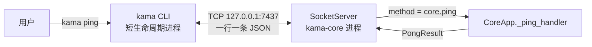
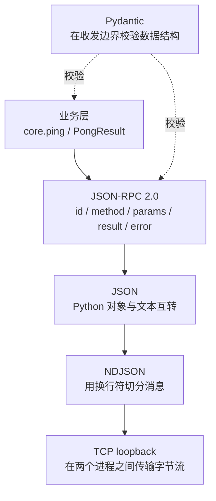
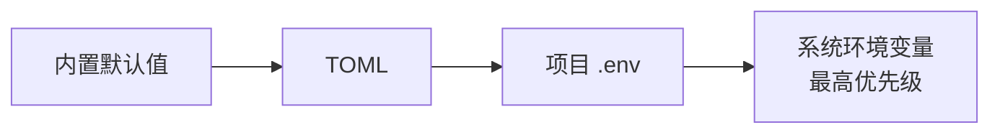
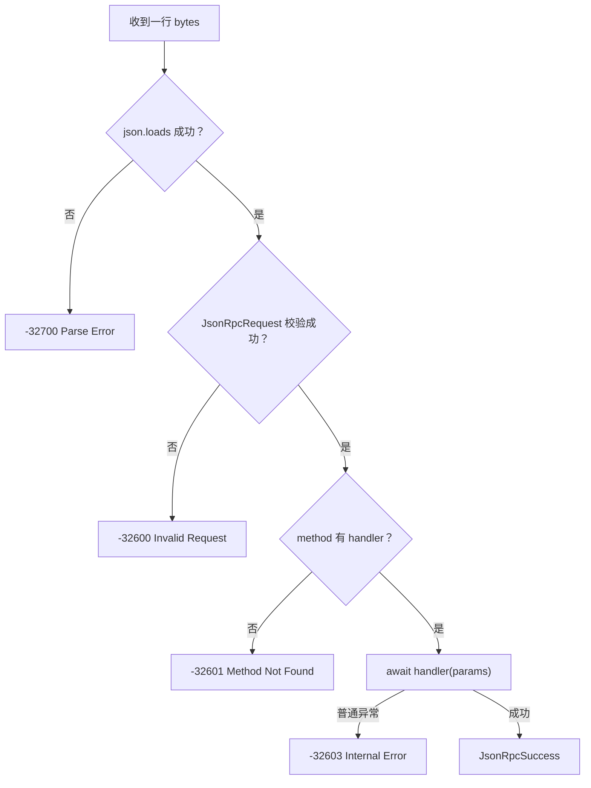
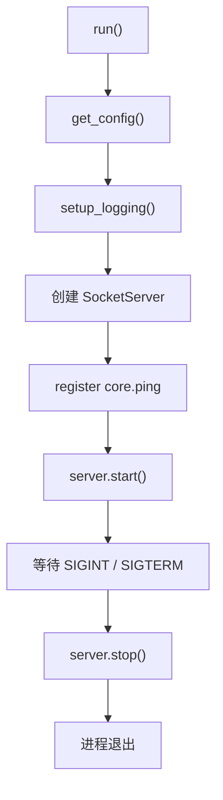
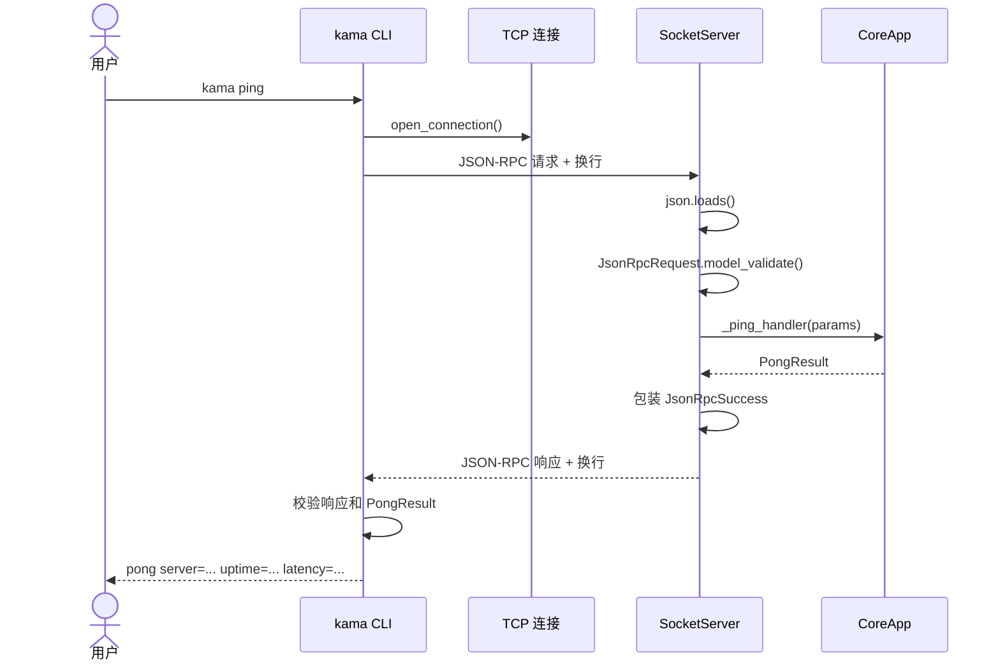
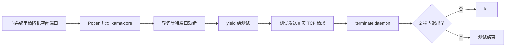

# KamaClaude S0 新手学习指南

> 适合第一次接触 Python 工程、网络通信、异步编程和 Agent 项目的读者。
>
> 对照资料：[语雀《S0-项目基础架构》](https://www.yuque.com/caca-stfs7/ciualn/qo2vlvim2sdmrmb3)
>
> S0 真实代码基线：`upstream/stage/s0`，提交 `89e6df4`，标签 `s0.0`。

---

## 0. 先别慌：S0 其实只做一件事

如果你第一次打开项目，看到 `asyncio`、TCP、JSON-RPC、Pydantic、daemon，
觉得每个词都不认识，这是正常的。

S0 不是要求你立刻掌握整个 Agent。它只要打通这一条路：

```text
用户输入 kama ping
    → kama CLI 连接 kama-core
    → 发出一条 core.ping 请求
    → kama-core 处理请求
    → 返回 pong
    → CLI 把 pong 打印出来
```

只要你最后能顺着代码讲清这次往返，S0 就合格了。

S0 暂时没有：

- LLM 调用；
- Agent Loop；
- 工具调用；
- 权限审批；
- Session；
- 上下文压缩；
- Skills、Subagents、MCP；
- 完整 TUI。

它只是先把以后所有能力都要经过的“路”修好。

## 1. 先建立一个生活化模型

可以把整个系统想成打客服电话：

| 项目概念 | 生活类比 |
|---|---|
| `kama` CLI | 打电话的顾客 |
| `kama-core` | 一直值班的客服中心 |
| TCP | 电话线路 |
| `127.0.0.1:7437` | 客服中心的本机号码 |
| NDJSON | 规定“一行只能说一件事” |
| JSON-RPC | 标准业务申请单 |
| `id` | 申请单编号 |
| `method` | 要办理的业务名称 |
| `params` | 办理业务需要的资料 |
| Pydantic | 检查申请单有没有漏填、填错 |
| handler | 真正办理该业务的客服 |
| `result` | 办理成功后的结果 |
| `error` | 办理失败后的结构化原因 |



最重要的一点：

> `kama` 和 `kama-core` 是两个独立的操作系统进程。

它们不能直接读取对方的 Python 变量，也不共享内存。它们必须把数据转换成字节，
通过 TCP 发送给对方。这就是 IPC（进程间通信）。

## 2. 看代码前先认识这些词

这里只讲到“够读懂 S0”为止，不要求背定义。

### 2.1 文件、模块、包

- 一个 `.py` 文件通常就是一个 Python 模块。
- 包是包含多个模块的目录，例如 `kama_claude.core`。
- `from kama_claude.core.config import get_config` 表示：
  从 `kama_claude/core/config.py` 中导入 `get_config`。

项目采用 `src layout`，真正的包放在：

```text
src/kama_claude/
```

安装项目后，无论当前终端在哪个目录，Python 都能稳定找到 `kama_claude`，
而不依赖“当前目录碰巧是仓库根目录”。

### 2.2 程序与进程

- 程序是磁盘上的代码。
- 进程是正在运行的程序实例。
- 同一份 Python 代码可以启动多个进程，每个进程有自己的内存。

在 S0 中：

- 终端 A 运行 `kama-core`，得到一个长期运行的 daemon 进程；
- 终端 B 运行 `kama ping`，得到一个很快结束的 CLI 进程。

这里的 daemon 不是 Windows Service，只是一个会一直运行、等待请求的普通前台进程。

### 2.3 客户端与服务器

- 主动发起连接的一方叫客户端；
- 等待连接、处理请求的一方叫服务器。

在 S0 中，CLI 是客户端，`kama-core` 是服务器。

### 2.4 host、port 和 `127.0.0.1`

- host 表示要连接哪台机器；
- port 表示连接这台机器上的哪个程序；
- `127.0.0.1` 表示“本机自己”，也叫 loopback；
- `7437` 是 KamaClaude 默认端口。

`127.0.0.1:7437` 合在一起，才构成一个明确的 TCP 地址。

### 2.5 字典、JSON、字符串和字节

Python 字典：

```python
{"method": "core.ping"}
```

JSON 文本：

```json
{"method": "core.ping"}
```

它们看起来很像，但不是同一种东西：

- 字典是 Python 内存中的对象；
- JSON 是跨语言可读的文本格式；
- TCP 传输的是 bytes，不是 Python 字典。

所以发送前需要：

```text
Python dict
→ json.dumps()
→ JSON 字符串
→ encode()
→ bytes
```

接收后反过来：

```text
bytes
→ JSON 文本
→ json.loads()
→ Python 对象
→ Pydantic 校验
```

这个过程分别叫序列化和反序列化。

### 2.6 同步、异步、协程和 `await`

网络 I/O 经常需要等待。例如客户端发完请求后，要等 daemon 返回。

如果普通同步程序一直干等，当前线程在等待期间什么也做不了。异步程序遇到等待时，
可以暂时把控制权交回事件循环，让它处理其他连接。

- `async def` 定义协程函数；
- 调用协程会得到协程对象；
- `await` 表示等待它完成，同时允许事件循环去做别的事；
- `asyncio.run()` 创建事件循环并运行最外层协程。

`await` 不等于“卡死整个服务器”。恰恰相反，它是异步程序主动让出执行机会的地方。

### 2.7 Schema 与运行时校验

普通类型注解：

```python
def f(port: int) -> None:
    ...
```

主要用于编辑器和类型检查器，不会自动拦住所有运行时坏数据。

Pydantic 的 `BaseModel` 会真的在运行时检查数据：

```python
JsonRpcRequest.model_validate(raw)
```

如果 `id` 缺失，或 `jsonrpc` 不是 `"2.0"`，Pydantic 会抛出
`ValidationError`。

## 3. 为什么一开始就拆成两个进程

最简单的 demo 可以写成：

```text
读用户输入 → 调一个函数 → 打印结果
```

但 KamaClaude 最终需要：

- CLI、TUI，甚至 Web 客户端同时连接；
- 前端退出时，后台任务仍可能继续；
- Core 长期保存 session、任务和运行状态；
- 所有请求、事件和审批都经过统一通信边界。

如果先把所有能力写成单进程函数调用，后期拆进程时就必须重新处理：

- 数据如何序列化；
- 网络如何失败；
- 请求和响应如何配对；
- 多客户端如何并发；
- 连接断开如何处理。

S0 选择先建立真实进程边界，让后续能力从第一天就遵守这些约束。

## 4. TCP、NDJSON、JSON-RPC 和 Pydantic 各管什么

这几个概念经常同时出现，但职责不同：



### 4.1 TCP：负责传字节

TCP 提供可靠、有序的字节流，但它不知道“消息”是什么。

下面两次写入：

```python
writer.write(b"hello")
writer.write(b"world")
```

对方可能一次读到 `helloworld`，也可能分几次读到。一次 `write()` 不保证对应一次
`read()`。

### 4.2 NDJSON：负责划分消息边界

NDJSON 的规则很简单：

> 每一行是一条完整 JSON，末尾必须有 `\n`。

于是服务端可以使用：

```python
line = await reader.readline()
```

没有换行时，`readline()` 通常会继续等待，因为它还不知道这条消息是否结束。

### 4.3 JSON-RPC：规定请求和响应长什么样

JSON-RPC 不负责联网。它只规定消息结构。

请求：

```json
{
  "jsonrpc": "2.0",
  "id": "cli-1",
  "method": "core.ping",
  "params": {
    "client": "cli/0.0.1"
  }
}
```

成功响应：

```json
{
  "jsonrpc": "2.0",
  "id": "cli-1",
  "result": {
    "server_version": "0.0.1",
    "uptime_ms": 12,
    "received_at": "2026-07-26T01:02:03+00:00"
  }
}
```

错误响应：

```json
{
  "jsonrpc": "2.0",
  "id": "cli-1",
  "error": {
    "code": -32601,
    "message": "Method not found: core.nonexistent",
    "data": null
  }
}
```

字段含义：

| 字段 | 作用 |
|---|---|
| `jsonrpc` | 协议版本，固定为 `"2.0"` |
| `id` | 请求编号；响应必须带回相同编号 |
| `method` | 服务端路由名 |
| `params` | 业务参数 |
| `result` | 成功结果 |
| `error` | 失败信息 |

`result` 和 `error` 表示两条不同结果路径：成功时返回 `result`，失败时返回 `error`。

### 4.4 Pydantic：负责检查结构

Pydantic 不负责 TCP，也不负责寻找 handler。它只检查数据是否符合模型。

例如：

```python
class JsonRpcRequest(BaseModel):
    jsonrpc: Literal["2.0"] = "2.0"
    id: str
    method: str
    params: dict[str, Any] = Field(default_factory=dict)
```

- `Literal["2.0"]` 表示只接受 `"2.0"`；
- `id: str` 表示必须有字符串 id；
- `params` 不传时生成一个新的空字典；
- `default_factory=dict` 避免多个对象意外共享同一个可变默认字典。

## 5. S0 文件地图

### 5.1 必须精读

| 顺序 | 文件 | 它解决的问题 |
|---:|---|---|
| 1 | `pyproject.toml` | 终端命令如何进入 Python 函数 |
| 2 | `core/bus/envelope.py` | JSON-RPC 外壳与错误码 |
| 3 | `core/bus/commands.py` | Ping 参数和 Pong 结果 |
| 4 | `core/config.py` | host、port 从哪里来 |
| 5 | `cli/main.py` | `kama ping` 如何分发到子命令 |
| 6 | `cli/commands/ping.py` | 客户端如何连接、发送和接收 |
| 7 | `core/transport/socket_server.py` | daemon 如何监听、读取、路由和响应 |
| 8 | `core/app.py` | daemon 如何把所有组件组装起来 |
| 9 | `tests/conftest.py` | 测试如何启动真实 daemon |
| 10 | `tests/integration/test_ping_roundtrip.py` | 如何证明跨进程 ping 真正跑通 |

### 5.2 配合理解

| 文件 | 作用 |
|---|---|
| `core/logging_setup.py` | 初始化终端日志和滚动文件日志 |
| `core/bus/events.py` | S0 只定义 `CoreStartedEvent` |
| `core/bus/__init__.py` | 统一重新导出协议类型 |
| `cli/commands/version.py` | 最简单的 CLI 命令 |
| `kama_claude/__init__.py` | 保存版本号 |
| `core/__main__.py` | `python -m kama_claude.core` 的入口 |
| `cli/__main__.py` | `python -m kama_claude.cli` 的入口 |
| `.env.example` | 环境变量配置模板 |
| `scripts/gen_protocol_doc.py` | 从模型生成协议文档 |
| `WIRE_PROTOCOL.md` | 生成后的协议阅读版 |
| `tests/unit/test_envelope.py` | 信封模型测试 |
| `tests/unit/test_commands_events.py` | Ping/Pong/Event 模型测试 |
| `tests/unit/test_config_env.py` | 配置优先级测试 |

### 5.3 知道存在即可

- `core/runs.py`：为 S1 的运行记录提前准备的路径辅助函数；
- S0 的 `tui/__main__.py`：当时只提示 TUI 要到 S2 才实现；
- `README.md`、`RUNBOOK.md`：项目说明和运行手册；
- `Makefile`：常用验证命令的快捷入口。

### 5.4 不要手改 `WIRE_PROTOCOL.md`

它是生成文件。正确流程是：

```text
修改 Pydantic 协议模型
→ 运行 scripts/gen_protocol_doc.py
→ 得到新的 WIRE_PROTOCOL.md
```

直接修改生成文件，下次运行脚本时会被覆盖。

## 6. 先读 `pyproject.toml`：命令从哪里进入

S0 最关键的入口配置：

```toml
[project.scripts]
kama = "kama_claude.cli.main:main"
kama-core = "kama_claude.core.app:run"
kama-tui = "kama_claude.tui.__main__:main"
```

等号左边是安装后能在终端输入的命令，右边是：

```text
Python 模块路径:函数名
```

所以：

```text
输入 kama
→ 导入 kama_claude.cli.main
→ 调用 main()
```

```text
输入 kama-core
→ 导入 kama_claude.core.app
→ 调用 run()
```

另一种入口是：

```powershell
python -m kama_claude.core
```

这会执行 `core/__main__.py`，它最后也调用 `app.run()`。

两条入口最终进入同一个函数，只是启动方式不同。

## 7. 配置系统：CLI 怎么知道连哪里

`kama ping` 必须知道：

- host：默认 `127.0.0.1`；
- port：默认 `7437`。

项目把所有配置合并到 `KamaConfig`，业务代码只接收这个对象。



同一项出现多次时，右边覆盖左边。

例如端口同时配置为：

| 来源 | 值 |
|---|---:|
| 默认值 | 7437 |
| TOML | 6000 |
| `.env` | 7000 |
| PowerShell 环境变量 | 8000 |

最终端口是 `8000`。

### 7.1 为什么先加载 `.env`

代码先执行：

```python
load_dotenv(".env", override=False)
```

然后才读取：

```python
os.environ.get("KAMA_CONFIG")
```

原因是 `.env` 自己可以声明 `KAMA_CONFIG`，从而决定 TOML 在哪里。

`override=False` 表示：

> 如果 PowerShell 已经设置了某个环境变量，`.env` 不覆盖它。

这就保证系统环境变量优先级最高。

### 7.2 环境变量为什么需要转换

操作系统环境变量都是字符串。

```text
KAMA_PORT=7437
```

读出来是 `"7437"`，配置模型需要的是整数 `7437`，所以代码必须调用 `int()`。
如果写成 `KAMA_PORT=abc`，程序会给出明确配置错误，而不是等 TCP 连接时再产生难懂异常。

### 7.3 当前路径与原始 S0 不同

| 项目 | 原始 `stage/s0` | 当前 `main` |
|---|---|---|
| 配置文件 | `~/.kama/config.toml` | `.kama/config.toml` |
| 日志文件 | `~/.kama/logs/core.log` | `.kama/logs/core.log` |

这是当前 Windows 开发环境的项目本地化调整。配置优先级概念没有改变。

## 8. CLI：一次 ping 是怎么发出去的

### 8.1 `cli/main.py`

它负责三件事：

1. 创建参数解析器；
2. 判断用户输入了哪个子命令；
3. 把控制权交给对应函数。

对于：

```powershell
kama ping
```

关键结果是：

```python
args.command == "ping"
```

于是调用：

```python
cmd_ping(config)
```

当前 `main` 还有 `chat`、`run`、`core`、`trace`，它们都是后续阶段。学习 S0 时跳过。

### 8.2 `cmd_ping()` 为什么是同步函数

CLI 的参数分发是普通同步代码，但 TCP I/O 是异步协程。

`cmd_ping()` 用：

```python
asyncio.run(_ping(config))
```

把同步入口和异步实现接起来。

### 8.3 `_ping()` 的完整步骤

1. 用 `time.monotonic()` 记录起点；
2. `asyncio.open_connection()` 建立 TCP 连接；
3. 构造 JSON-RPC 请求字典；
4. `json.dumps()` 转成 JSON 文本；
5. 加上 `\n`，形成一条 NDJSON；
6. `encode()` 转成 bytes；
7. `writer.write()` 放入发送缓冲；
8. `await writer.drain()` 处理缓冲和背压；
9. `reader.readline()` 等待一整行响应；
10. 关闭连接；
11. 校验 JSON-RPC 外壳；
12. 校验 `PongResult`；
13. 打印结果。

`uptime_ms` 和 `latency_ms` 不同：

- uptime 由 daemon 计算，表示 daemon 已运行多久；
- latency 由 CLI 计算，包含连接、发送、服务端处理和接收的总耗时。

这里的 `kama ping` 是应用层自定义命令，不是操作系统的 ICMP `ping`。

## 9. 协议模型：坏消息先挡在边界上

### 9.1 `envelope.py`

它定义 JSON-RPC 的公共外壳：

- `JsonRpcRequest`；
- `JsonRpcSuccess`；
- `JsonRpcErrorObject`；
- `JsonRpcError`；
- 五个错误码；
- `make_error()` 工厂函数。

“外壳”不关心 `core.ping` 做什么，只关心消息有没有 id、method、params、result 或 error。

### 9.2 `commands.py`

S0 只需看：

```python
PingCommand
PongResult
Command
```

`Command` 使用 `type` 作为判别字段。看到：

```json
{"type": "core.ping", "client": "cli/0.0.1"}
```

Pydantic 就知道应该用 `PingCommand` 校验。

### 9.3 `method` 和 `type` 不是一个位置

- JSON-RPC `method` 是传输路由字段；
- `PingCommand.type` 是业务联合模型的判别字段。

它们目前字符串都叫 `"core.ping"`，但职责不同。

更值得注意的是：真实 S0 CLI 发出的 `params` 只有：

```json
{"client": "cli/0.0.1"}
```

其中没有 `type`。真实 S0 `_ping_handler()` 也没有调用
`PingCommand.model_validate(params)`。

所以 `PingCommand` 在 S0 更像“先定义好的业务契约”，还没有完全接入运行路径。

### 9.4 `events.py`

S0 定义了 `CoreStartedEvent`，但真实 S0 运行路径没有把这个事件推送到客户端。

这再次说明：

> “模型已经定义”不等于“功能已经接入运行时”。

## 10. SocketServer：S0 最重要的文件

可以按实际调用顺序理解它。

### 10.1 `__init__()`

保存：

- host；
- port；
- handler 字典；
- 底层 asyncio server。

原始 S0 的 handler 字典最终类似：

```python
{
    "core.ping": CoreApp._ping_handler
}
```

### 10.2 `register()`

把方法名和处理函数关联：

```python
server.register("core.ping", self._ping_handler)
```

以后 `_handle_line()` 收到 `method == "core.ping"`，就能从字典找到对应函数。

### 10.3 `start()`

启动前先尝试连接目标地址：

- 若连接成功，说明有人正在监听，退出并提示 core 已运行；
- 若连接失败，才调用 `asyncio.start_server()` 绑定端口。

这是一个轻量探活，但也有局限：

> 它只能证明端口有人监听，不能百分之百证明对方一定是 KamaClaude。

若其他软件占用了 7437，S0 也会认为 core 已经在运行。

### 10.4 `_handle_connection()`

每当一个客户端连进来，asyncio 为它调用一次这个函数。

函数进入 `_read_loop()`，连接断开后通过 `finally` 清理 writer。

`finally` 很重要：无论正常结束还是中途异常，清理逻辑都会执行。

### 10.5 `_read_loop()`

它不断调用：

```python
line = await reader.readline()
```

- 读到一行：交给 `_handle_line()`；
- 读到空 bytes：客户端已关闭连接；
- 按代码意图，单行太大时应该返回错误并关闭本次连接。

原始 S0 的帧上限是 1 MB。当前 `main` 为 MCP 大结果扩展到 64 MB。

> **这里有一个真实的既有代码缺口：**Python 3.12 中，
> `StreamReader.readline()` 遇到超长行时会把底层的
> `LimitOverrunError` 转成 `ValueError`，但 S0 和当前 `main`
> 捕获的是 `LimitOverrunError`。所以现在的实际表现通常是连接处理协程异常结束、
> 连接被关闭，而不是稳定返回 `Request too large` 的结构化错误。
> 学习时请把“限制报文大小”理解为设计意图，不要把当前异常分支误认为已经完整实现。

### 10.6 `_handle_line()`

这是 ping 服务端路径的核心。



处理成功时：

1. handler 返回 `PongResult`；
2. `model_dump()` 把它变成字典；
3. 字典放进 `JsonRpcSuccess.result`；
4. `_send()` 把成功响应发回客户端。

### 10.7 `_send()`

关键代码可以概括为：

```python
writer.write(json_bytes + b"\n")
await writer.drain()
```

客户端和服务端完全对称：双方都用一行 JSON 表示一条消息。

### 10.8 当前 `main` 的并发变化

原始 S0 每读到一行就：

```python
await self._handle_line(line, writer)
```

当前 `main` 为了不让长任务阻塞权限响应，改成独立 task：

```python
asyncio.create_task(self._handle_line(line, writer))
```

这是后续阶段需求。理解 S0 时先按“读一条、处理一条、回一条”的顺序模型学习。

## 11. CoreApp：daemon 怎么被组装起来

原始 S0 生命周期：



### 11.1 `_ping_handler()`

它返回三个字段：

- `server_version`：daemon 版本；
- `uptime_ms`：从 daemon 启动到现在的时长；
- `received_at`：收到请求时的 UTC 时间。

运行时长使用 `time.monotonic()`，因为它只向前递增，不受人工修改系统时间影响。

真实时间使用 UTC datetime，便于跨时区日志统一比较。

### 11.2 `asyncio.Event()` 为什么存在

daemon 不能启动后立刻退出，所以创建：

```python
shutdown = asyncio.Event()
await shutdown.wait()
```

收到 `Ctrl+C` 或终止信号后，回调调用 `shutdown.set()`，等待结束，程序继续执行清理代码。

### 11.3 Windows 差异

原始 `stage/s0` 面向 macOS/Linux，直接使用：

```python
loop.add_signal_handler(...)
```

Windows 默认事件循环可能不支持该接口。当前 `main` 已加入
`signal.signal()` 回退和对应测试。

### 11.4 当前 `main` 为什么看起来特别长

当前 `CoreApp` 还组装了：

- trace；
- EventBus；
- PermissionManager；
- SessionManager；
- AgentRunner；
- MCP；
- 多种 handler。

这些都不是 S0。阅读时寻找代码中的 `S0 步骤` 注释，其余先跳过。

## 12. 一次 ping 的完整时序



建议你自己拿一张纸，再画一遍。能不看文档画出来，说明主线已经进入脑子。

## 13. 错误码怎么理解

| 错误码 | 含义 | 例子 |
|---:|---|---|
| `-32700` | Parse Error | 收到 `not valid json` |
| `-32600` | Invalid Request | JSON 合法但缺少 `id` |
| `-32601` | Method Not Found | 请求 `core.nonexistent` |
| `-32602` | Invalid Params | 业务参数不符合模型 |
| `-32603` | Internal Error | handler 发生未预期异常 |

### 13.1 真实 S0 的两个小缺口

语雀正文按更清晰的理想职责讲解了业务参数验证，但真实 `s0.0` Git 快照有两个差异：

1. `_ping_handler()` 没有调用 `PingCommand.model_validate()`；
2. `socket_server.py` 捕获 handler 的 `ValidationError` 时返回 `-32600`，
   而不是已经定义的 `-32602`。

因此，真实 S0 中缺少 `client` 的 ping 会被接受，并把 client 记为 `"unknown"`。

这不是你读错了，而是学习工程代码时很重要的一课：

> 文档、协议模型和运行实现可能有细小漂移，最终要用测试和实际代码互相核对。

## 14. 日志在做什么

`logging_setup.py` 给 root logger 安装两个可能的 handler：

1. stderr handler：始终输出到终端；
2. rotating file handler：配置了文件路径时写入滚动日志。

为什么日志写 stderr？

- stdout 留给命令的正常机器可读输出；
- stderr 放诊断、告警和错误；
- 管道或脚本可以把两类输出分开。

滚动日志限制单文件 10 MB，并保留 5 份旧文件，防止 daemon 长期运行时无限占用磁盘。

## 15. 测试怎么证明它真的能工作

### 15.1 单元测试

单元测试只验证小模块：

- `test_envelope.py`：模型能否序列化往返、坏版本能否拒绝；
- `test_commands_events.py`：Ping/Pong/Event 字段契约；
- `test_config_env.py`：配置覆盖顺序。

它们快、容易定位错误，但不能单独证明 TCP 跨进程链路能跑。

### 15.2 集成测试

`test_ping_roundtrip.py` 会：

- 真启动一个 daemon 子进程；
- 真绑定随机 TCP 端口；
- 真发送一行 JSON-RPC；
- 真读取网络响应；
- 真检查返回字段和错误码。

### 15.3 fixture 生命周期



几个容易困惑的点：

- `bind(("127.0.0.1", 0))` 中的 0 表示让系统分配空闲端口；
- 测试参数写了 `running_daemon`，即使不用它的返回值，也会触发 fixture；
- 固定 `sleep(1)` 可能太短或浪费时间，轮询端口就绪更可靠；
- `yield` 前是准备，`yield` 后是清理；
- 先 `terminate()`，超时后才 `kill()`，避免遗留后台进程。

真实 S0 有 20 个测试。

当前 `tests/unit/test_socket_server.py` 是后续阶段为 broadcaster 添加的回归测试，
并不在原始 `stage/s0` 快照中，可作为补充阅读。

## 16. 当前 `main` 与真实 S0 的差异

这是你现在最容易困惑的来源。

| 内容 | 真实 S0 | 当前 `main` |
|---|---|---|
| Commands | 只有 ping | Agent、Session、Permission 等很多命令 |
| Events | 只有 `CoreStartedEvent` | Run、Tool、LLM 等大量事件 |
| `CoreApp` | 配置、日志、ping server | 还组装 trace、Session、MCP、权限等 |
| 单帧上限 | 1 MB | 64 MB |
| 请求执行 | 逐条 `await` | 每条创建独立 task |
| Windows 信号 | 未兼容 | 有同步 signal 回退 |
| 默认数据路径 | `~/.kama/` | 项目内 `.kama/` |
| TUI | 占位提示 | 已完整实现 |
| `socket_client.py` | 不存在 | 后续阶段新增 |

### 16.1 安全查看原始 S0

当前工作区已有学习注释，不建议此时直接切换分支。可以只读查看：

```powershell
git show upstream/stage/s0:src/kama_claude/core/app.py
git show upstream/stage/s0:src/kama_claude/core/transport/socket_server.py
git show upstream/stage/s0:src/kama_claude/cli/commands/ping.py
```

比较当前版本：

```powershell
git diff upstream/stage/s0 -- src/kama_claude/core/app.py
```

## 17. 推荐阅读顺序与时间

不要一口气读完。

### 第一次：只看全景，约 45 分钟

1. 本文第 0～4 节；
2. `pyproject.toml` 的三个入口；
3. 架构图和完整时序图；
4. 暂时不钻语法细节。

目标：知道有两个进程，消息经过 TCP 往返。

### 第二次：跟踪客户端，约 60 分钟

1. `cli/main.py`；
2. `cli/commands/ping.py`；
3. 手抄一次请求 JSON；
4. 弄懂 `encode()`、`\n`、`drain()` 和 `readline()`。

目标：能解释请求怎么离开 CLI。

### 第三次：跟踪服务端，约 90 分钟

1. `envelope.py`；
2. `commands.py`；
3. `socket_server.py`；
4. `app.py` 中的 S0 注释段。

目标：能解释一行 bytes 怎么变成 `PongResult`。

### 第四次：看测试，约 60 分钟

1. `tests/conftest.py`；
2. 两个协议错误集成测试（非法 JSON、未知 `method`），再看成功 `ping` 用例；
3. 配置优先级测试；
4. 自己运行相关测试。

目标：知道每个关键结论是怎么被证明的。

## 18. 动手实验

### 实验 1：运行最短入口

```powershell
conda activate "E:\conda_envs\kamaclaude"
kama --version
```

追踪：

```text
pyproject.toml
→ cli/main.py
→ commands/version.py
→ kama_claude.__version__
```

### 实验 2：真实 ping

终端 A：

```powershell
Set-Location "E:\工作\agent项目\KamaClaude"
conda activate "E:\conda_envs\kamaclaude"
kama-core
```

终端 B：

```powershell
Set-Location "E:\工作\agent项目\KamaClaude"
conda activate "E:\conda_envs\kamaclaude"
kama ping
```

观察：

- daemon 终端是否打印连接日志；
- CLI 是否显示 server、uptime、latency；
- 连续 ping 时 uptime 是否增长。

### 实验 3：daemon 未运行

关闭终端 A，再运行：

```powershell
kama ping
```

思考：错误是在 `cmd_ping()`、`_ping()`、SocketServer 还是 handler 中产生的？

答案：连接都没建立成功，异常由 `_ping()` 向上传到 `cmd_ping()` 处理。

### 实验 4：改变端口

终端 A：

```powershell
$env:KAMA_PORT = "8000"
kama-core
```

终端 B：

```powershell
$env:KAMA_PORT = "8000"
kama ping
```

两边必须使用同一端口。实验后清理：

```powershell
Remove-Item Env:KAMA_PORT -ErrorAction SilentlyContinue
```

### 实验 5：直接发原始请求

把下面代码放到 Python REPL 或临时学习脚本中：

```python
import socket

request = (
    b'{"jsonrpc":"2.0","id":"manual-1",'
    b'"method":"core.ping","params":{"client":"manual"}}\n'
)

with socket.create_connection(("127.0.0.1", 7437)) as sock:
    sock.sendall(request)
    response = sock.makefile("rb").readline()
    print(response.decode())
```

这个实验绕过项目 CLI，直接验证 wire 协议。

### 实验 6：三种错误

依次把 `request` 改为：

```python
b"not valid json\n"
```

```python
b'{"jsonrpc":"2.0","method":"core.ping","params":{}}\n'
```

```python
b'{"jsonrpc":"2.0","id":"x","method":"core.nonexistent","params":{}}\n'
```

观察 `-32700`、`-32600`、`-32601`。

### 实验 7：故意不发换行

发送合法 JSON，但删掉末尾 `\n`。

你会发现服务端可能继续等待，因为 `readline()` 不知道一条消息是否已经结束。

### 实验 8：运行 S0 相关测试

```powershell
python -m pytest tests/unit/test_envelope.py -v
python -m pytest tests/unit/test_commands_events.py -v
python -m pytest tests/unit/test_config_env.py -v
python -m pytest tests/integration/test_ping_roundtrip.py -v
```

### 最终挑战：设计 `core.echo`

不要急着写。先回答至少要改哪里：

1. `commands.py`：定义 Echo 参数和结果；
2. `CoreApp`：实现 echo handler；
3. `CoreApp.run()`：注册 `"core.echo"`；
4. CLI 或原始 socket：发送 echo 请求；
5. 单元测试：验证模型；
6. 集成测试：验证跨进程往返；
7. 重新生成 `WIRE_PROTOCOL.md`。

## 19. 常见误区

### “daemon 就是 Windows Service”

不是。S0 只是一个长期运行的独立前台进程。

### “CLI import 了 core，所以两个进程共享变量”

不是。import 只说明代码依赖；两个已启动进程的内存仍互相隔离。

### “TCP 一次 write 就是一条消息”

不是。TCP 是字节流，NDJSON 的换行才是本项目约定的消息边界。

### “JSON 就是 Python dict”

不是。dict 是内存对象，JSON 是文本，网络上传输的是编码后的 bytes。

### “JSON-RPC 会负责网络连接”

不会。JSON-RPC 只是消息格式，TCP 才负责传输。

### “id 是端口号或进程号”

不是。它只是请求关联编号。

### “类型注解会自动校验网络数据”

不一定。必须显式经过 `model_validate()` 等 Pydantic 入口。

### “writer.write() 后数据肯定已经全部到达”

不能这样理解。`write()` 先写入缓冲，`drain()` 用于处理缓冲和背压。

### “`.env` 优先级最高”

不是。`override=False` 保证已存在的系统环境变量优先级更高。

### “CoreStartedEvent 已经通过网络发出”

真实 S0 只是定义了模型，并未接入推送链路。

### “当前 main 里的所有代码都是 S0”

不是。当前 `main` 已包含 S1-S7，所以要依靠注释中的阶段分界阅读。

## 20. 自测题

先自己回答，再展开参考答案。

### 1. S0 证明了什么，又没有证明什么？

<details>
<summary>参考答案</summary>

证明 CLI 与独立 daemon 能通过真实 TCP/NDJSON/JSON-RPC 完成请求响应。
没有证明 Agent 能调用 LLM、规划、执行工具或管理上下文。

</details>

### 2. 为什么 TCP 之上还需要 NDJSON？

<details>
<summary>参考答案</summary>

TCP 只有连续字节流，没有天然消息边界。NDJSON 用换行规定一条消息在哪里结束，
因此双方可以用 `readline()` 读取完整帧。

</details>

### 3. 请求末尾没有 `\n` 会怎样？

<details>
<summary>参考答案</summary>

只要连接仍保持打开，服务端 `readline()` 通常会继续等待，因为它不知道本条消息已经结束。

</details>

### 4. `id` 有什么用？

<details>
<summary>参考答案</summary>

服务端在响应中带回同一个 id，客户端可以判断响应属于哪个请求。并发请求增加后尤其重要。

</details>

### 5. `method` 如何找到 `_ping_handler()`？

<details>
<summary>参考答案</summary>

`CoreApp.run()` 调用 `server.register("core.ping", self._ping_handler)`，
SocketServer 把映射保存到字典，收到请求后用 `req.method` 查字典。

</details>

### 6. 无效 JSON、缺 id、未知 method 分别返回什么？

<details>
<summary>参考答案</summary>

- 无效 JSON：`-32700`；
- 缺 id：`-32600`；
- 未知 method：`-32601`。

</details>

### 7. 为什么 uptime 用 `time.monotonic()`？

<details>
<summary>参考答案</summary>

它只向前递增，不受用户修改系统时间或时钟同步影响，更适合测持续时长。

</details>

### 8. 为什么 `.env` 要在确定 TOML 路径前加载？

<details>
<summary>参考答案</summary>

因为 `.env` 可能设置 `KAMA_CONFIG`。如果先确定或读取 TOML，
`.env` 就无法改变 TOML 路径。

</details>

### 9. 测试函数没有使用 `running_daemon` 的值，fixture 还会运行吗？

<details>
<summary>参考答案</summary>

会。只要参数名请求了 fixture，pytest 就会先执行它。该参数的主要意义是确保 daemon
在测试期间存在，返回的 Popen 对象不一定要被测试体读取。

</details>

### 10. 真实 S0 中缺少 client 的 ping 会怎样？

<details>
<summary>参考答案</summary>

仍会成功。`_ping_handler()` 使用 `params.get("client", "unknown")`，
没有调用 `PingCommand.model_validate()`。

</details>

## 21. 最终验收清单

### 基础通过

- [ ] 能启动 `kama-core`；
- [ ] 能在另一个终端执行 `kama ping`；
- [ ] 知道 CLI 和 daemon 是两个进程；
- [ ] 能说出五个核心文件的作用。

### 熟练通过

- [ ] 能从 `pyproject.toml` 一直追踪到 `_ping_handler()`；
- [ ] 能解释 TCP、NDJSON、JSON-RPC、JSON、Pydantic 的分工；
- [ ] 能解释配置覆盖顺序；
- [ ] 能画出 ping 往返图；
- [ ] 能解释三种常见错误码；
- [ ] 能看懂 `running_daemon` fixture。

### 挑战通过

- [ ] 能用原始 socket 发合法请求和错误请求；
- [ ] 能解释真实 S0 与语雀理想职责的两个差异；
- [ ] 能说出新增 `core.echo` 要改哪些文件；
- [ ] 能区分当前 `main` 中哪些代码不属于 S0。

如果你暂时只能做到“基础通过”，也完全没问题。先把一条 ping 路径走熟，
再进入 S1；不要因为当前 `main` 中存在大量后续代码，就误以为那些也必须在 S0 一次学完。
