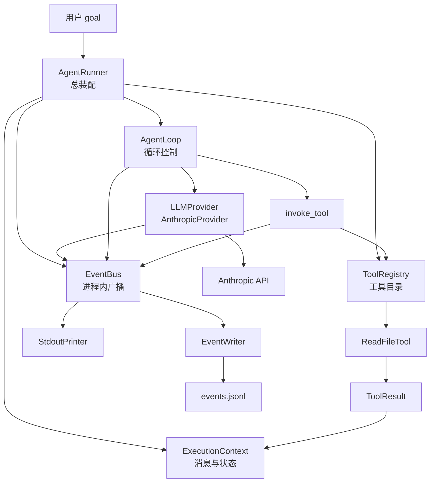
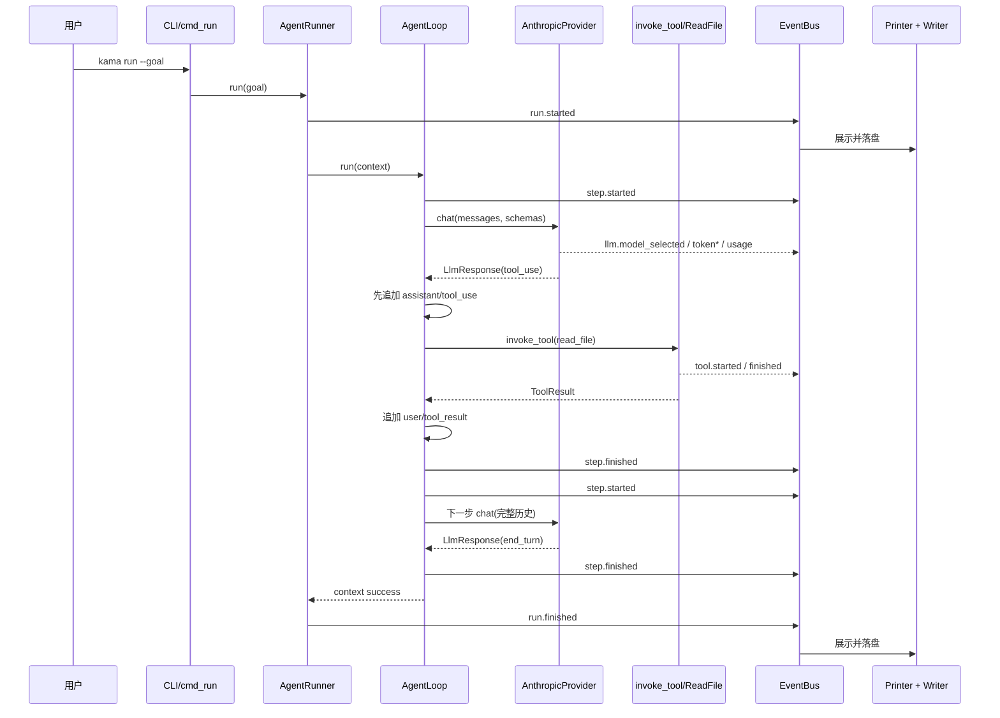
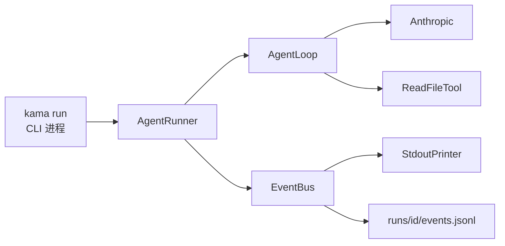
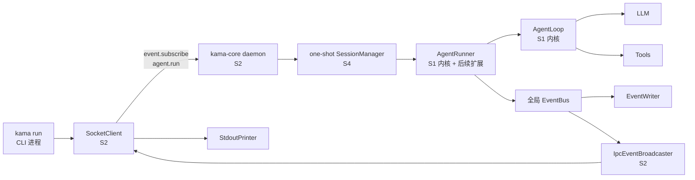

# KamaClaude S1 新手学习指南

> 适合已经走完 S0，第一次接触 LLM API、Agent Loop、工具调用和事件流的读者。
>
> 对照资料：[语雀《S1-Agent 第一次运行》](https://www.yuque.com/caca-stfs7/ciualn/o515ksc9wgmrmb3v)
>
> S1 真实代码基线：`upstream/stage/s1`，提交 `76e2992`，
> 标签 `s1.0.0` / `v1.0.0`。
>
> S1 的直接父提交（上一阶段基线）：`upstream/stage/s0`，提交 `89e6df4`。

---

## 0. 先别慌：S1 其实只打通一个闭环

S0 修好了一条“CLI 和 daemon 可以互相说话”的路。

S1 第一次让 Agent 真正做事：

```text
用户给出 goal
    → LLM 决定下一步
    → 如果需要文件，就请求 read_file
    → 程序执行工具
    → 把工具结果交回 LLM
    → LLM 给出最终回答
    → 关键运行事件实时打印并写入 events.jsonl
```

`events.jsonl` 是事件时间线，不是全部内存状态的快照。
原始 S1 会记录成功工具的耗时，但不会把成功工具的输出内容写进事件文件；
该内容只在本次运行的 messages 中继续流向 LLM。

你不需要一开始就理解当前 `main` 的全部功能。

学完 S1，只要能回答下面四个问题，就已经抓住主线：

1. `goal` 怎样变成第一条 LLM 消息？
2. LLM 的 `tool_use` 怎样找到并执行 `ReadFileTool`？
3. 工具结果为什么要作为一条 `user/tool_result` 消息回填？
4. 同一个运行事件怎样同时出现在终端和 `events.jsonl`？

S1 暂时不要求学习：

- S2 的 daemon 内执行、SocketClient 和 IPC 事件订阅；
- S3 的 TUI、TaskManager、Trace 和多工具体系；
- S4 的 Session、thread、notes 和多轮会话；
- S5 的权限审批、完整参数校验和失败重试；
- S6 的上下文水位、截断与 compact；
- S7 的 Skills、Subagents、MCP 和 extended thinking。

当前 `main` 已经包含这些后续代码，所以“当前文件很长”不等于“S1 很复杂”。

## 1. 本指南如何做事实核查

本指南同时使用了三类资料：

1. 当前 Chrome 中打开的语雀 S1 文档；
2. 当前仓库 `main`；
3. 真实阶段快照 `upstream/stage/s1` / `s1.0.0`。

它们不一致时，采用以下优先级：

```text
真实 S1 阶段代码
    > 当前 main 中仍保留的真实行为
    > 语雀中的概念说明或示例
```

原因很简单：

- 语雀适合解释设计意图；
- 阶段快照才精确回答“S1 当时到底写了什么”；
- 当前 `main` 用来回答“现在打开这个文件为什么不一样”。

本次核对得到的 Git 事实是：

```text
upstream/stage/s0  89e6df4
        │
        └── upstream/stage/s1  76e2992
              ├── tag: s1.0.0
              └── tag: v1.0.0
```

`s0.0` 是 annotated tag，所以：

```powershell
git rev-parse s0.0
```

看到的是 tag 对象 ID，而：

```powershell
git rev-parse "s0.0^{}"
```

才会解引用到提交 `89e6df4`。比较阶段时，最不容易出错的写法是：

```powershell
git diff upstream/stage/s0..upstream/stage/s1
```

## 2. S1 的学习目标

### 2.1 基础目标

完成 S1 后，你应该能：

- 解释 `AgentRunner`、`AgentLoop` 和 `ExecutionContext` 的分工；
- 读懂 Anthropic 的 `user`、`assistant`、`tool_use`、`tool_result` 消息；
- 解释 `LLMProvider` 为什么用 `Protocol`；
- 解释 `BaseTool`、`ToolRegistry`、`invoke_tool` 为什么分三层；
- 顺着一次两步任务讲清完整调用链；
- 根据事件类型复盘一次 run；
- 用单元测试验证闭环，而不必每次消耗真实 API。

### 2.2 进阶目标

如果想达到“可以向别人讲明白”的程度，还应能：

- 说明为什么必须先记录 assistant 的 `tool_use`，再记录工具结果；
- 说明工具失败为什么通常不直接终止 Agent；
- 说明 `EventBus` 为什么不负责 JSON 序列化；
- 说明 `asyncio.CancelledError` 为什么要重新抛出；
- 区分原始 S1 单进程入口与当前 `main` 的双进程入口；
- 指出阶段代码的已知边界，而不是把文档描述当成已经实现的安全保证。

## 3. 前置知识：只补到够读懂 S1

### 3.1 建议先完成 S0

S1 直接复用了 S0 的：

- Python `src` 项目结构；
- `pyproject.toml` 命令入口；
- `KamaConfig` 配置加载；
- 日志基础；
- Pydantic 模型；
- `asyncio` 基础。

如果下面这些词仍完全陌生，建议先读
[《S0 新手学习指南》](S0_新手学习指南.md)：

- 模块和包；
- 进程与协程；
- `async def`、`await`、`asyncio.run()`；
- JSON 与 Python 对象的区别；
- Pydantic 的运行时校验。

### 3.2 dataclass 是什么

S1 用 `@dataclass` 保存内部运行状态：

```python
@dataclass
class ToolCallBlock:
    id: str
    name: str
    input: dict[str, object]
```

它主要帮我们自动生成初始化方法：

```python
ToolCallBlock(id="toolu_01", name="read_file", input={"path": "README.md"})
```

这里选择 dataclass，是因为这些对象主要在进程内部传递。

事件模型则使用 Pydantic，因为它们要：

- 校验字段；
- 序列化为 JSON；
- 写入 `events.jsonl`；
- 在后续阶段通过 IPC 发送。

### 3.3 Protocol 是什么

`LLMProvider` 是一个 `Protocol`：

```python
class LLMProvider(Protocol):
    async def chat(...) -> LlmResponse:
        ...
```

它表达的是：

> 只要一个对象拥有形状兼容的 `chat()`，就可以被 AgentLoop 当作 LLM Provider。

测试里的 `_MockProvider` 不必继承 `AnthropicProvider`。
它只要实现同样的 `chat()` 就能替换真实 API。

这叫结构化类型，也常被称为“鸭子类型的静态版本”。

### 3.4 ABC 和 abstractmethod 是什么

`BaseTool` 使用抽象基类：

```python
class BaseTool(ABC):
    @abstractmethod
    async def invoke(...) -> ToolResult:
        ...
```

它要求具体工具必须实现 `invoke()`。

同时，具体工具还要提供：

- `name`：运行时查找键；
- `description`：告诉 LLM 工具做什么；
- `input_schema`：告诉 LLM 参数长什么样。

### 3.5 流式输出是什么

非流式调用要等完整回答生成后才返回。

流式调用会不断产生小片段：

```text
"I"
" will"
" read"
" the file"
```

S1 每收到一个片段，就发布一个 `llm.token` 事件。

因此终端能一边生成一边显示，而不是长时间没有反馈。

### 3.6 JSONL 是什么

JSONL 也叫 NDJSON：每一行是一条完整 JSON。

```json
{"type":"run.started","run_id":"r1","goal":"总结 README","ts":"..."}
{"type":"step.started","run_id":"r1","step":1,"ts":"..."}
```

它适合事件日志，因为：

- 可以逐条追加；
- 不必等 run 结束再写整个大数组；
- 程序中途退出时，之前的完整行仍可读取；
- 可以一行一行流式处理。

## 4. S1 相比 S0 增加了什么

| 维度 | S0 | S1 |
|---|---|---|
| 用户动作 | `kama ping` | `kama run --goal "..."` |
| 核心目标 | 验证 CLI/daemon IPC | 跑通 Agent 最小闭环 |
| 模型调用 | 没有 | Anthropic 流式调用 |
| 状态 | ping 请求/响应 | `ExecutionContext` 消息历史与步骤状态 |
| 控制器 | SocketServer handler | `AgentLoop` |
| 工具 | 没有 | `ToolRegistry` + `ReadFileTool` |
| 失败处理 | JSON-RPC error | 失败 `ToolResult` 回填给 LLM |
| 可观测性 | 日志、pong | Run/Step/LLM/Tool 事件 |
| 持久化 | 无 run 记录 | `runs/<run_id>/events.jsonl` |
| 测试重点 | 协议与 TCP | 消息、循环、工具、Provider、事件文件 |

真实 S0 → S1 只有一个提交，但一次修改了 36 个文件：

- 22 个源码文件；
- 10 个测试文件；
- 4 个配置、脚本或生成文档。

原始 S1 新增：

- 66 个单元测试函数；
- 1 个需要真实 Anthropic API 的端到端测试。

数量看起来很多，是因为它把一条链拆成了可单独验证的小组件。

## 5. 先建立一个生活化模型

可以把一次 run 想成一个小型项目组：

| 项目概念 | 生活类比 |
|---|---|
| `AgentRunner` | 项目经理，先把人、工具和记录系统组织起来 |
| `ExecutionContext` | 共享工作笔记，保存目标、对话和进度 |
| `AgentLoop` | 工作节奏：想一步、做一步、看结果、再决定 |
| `LLMProvider` | 对外沟通员，把内部格式翻译给模型 SDK |
| `ToolRegistry` | 工具柜目录，按名字找工具 |
| `ReadFileTool` | 真正去读取文件的执行者 |
| `ToolResult` | 工具交回的工作结果或失败说明 |
| `EventBus` | 办公室广播，通知所有观察者 |
| `StdoutPrinter` | 把广播变成终端文字的播报员 |
| `EventWriter` | 把广播逐条写入档案的记录员 |



## 6. S1 文件地图

下面的文件集来自真实差异：

```powershell
git diff --name-status upstream/stage/s0..upstream/stage/s1
```

### 6.1 配置、脚本和生成文档

| 文件 | S1 作用 | 阅读建议 |
|---|---|---|
| `.env.example` | S0 已预留三项；S1 把 `KAMA_LLM_MODEL` 改名为 `KAMA_LLM_DEFAULT_MODEL` | 先读 |
| `pyproject.toml` | 增加 `anthropic` 依赖和 `integration` pytest marker | CLI 的 `kama` 入口未变 |
| `scripts/gen_protocol_doc.py` | 把新增事件模型写入协议文档 | 知道生成关系 |
| `WIRE_PROTOCOL.md` | 生成后的 Run/Step/Tool/LLM 事件说明 | 只读，不手改 |

### 6.2 CLI 与配置

| 文件 | S1 作用 | 当前 main 提示 |
|---|---|---|
| `src/kama_claude/cli/main.py` | 解析 `run --goal` 并调用 `cmd_run` | `chat/core/trace` 可跳过 |
| `src/kama_claude/cli/commands/run.py` | 原始 S1 创建 Printer 和 Runner | 当前 IPC 客户端部分属于 S2 |
| `src/kama_claude/core/config.py` | 增加 `AgentConfig`、`LlmConfig` | Trace/Permission/Compaction/MCP 可跳过 |
| `src/kama_claude/core/runs.py` | 生成 run_id，约定 run 目录和事件文件 | 当前 session 路径另有后续包装 |

### 6.3 运行上下文与循环

| 文件 | S1 作用 | 当前 main 提示 |
|---|---|---|
| `src/kama_claude/core/context.py` | 保存 goal、messages、step、status、reason | prefill/context/override 属于后续阶段 |
| `src/kama_claude/core/loop.py` | 驱动 LLM、记录响应、执行工具并判断终止 | 权限、compact、thinking 可跳过 |
| `src/kama_claude/core/runner.py` | 组装全部 S1 组件并管理 run 生命周期 | 多工具、session、trace、subagent 可跳过 |

### 6.4 LLM 子包

| 文件 | S1 作用 | 阅读建议 |
|---|---|---|
| `src/kama_claude/core/llm/__init__.py` | 统一导出 LLM 公共类型 | 快速看 |
| `src/kama_claude/core/llm/base.py` | 定义 `LLMProvider` 协议 | 精读 |
| `src/kama_claude/core/llm/types.py` | 定义 usage、tool call、统一响应 | 精读 |
| `src/kama_claude/core/llm/provider.py` | 调 Anthropic 流、发布 token/usage、提取工具请求 | 精读 |

### 6.5 工具子包

| 文件 | S1 作用 | 阅读建议 |
|---|---|---|
| `src/kama_claude/core/tools/__init__.py` | 统一导出工具公共接口 | 快速看 |
| `src/kama_claude/core/tools/base.py` | 定义 `BaseTool` 与 `ToolResult` | 精读 |
| `src/kama_claude/core/tools/registry.py` | 注册工具、按名称查找、导出 schema | 精读 |
| `src/kama_claude/core/tools/invocation.py` | 统一处理事件、查找、校验、超时和错误 | 精读 S1 主干 |
| `src/kama_claude/core/tools/builtin/__init__.py` | 统一导出内建工具 | S1 只找 `ReadFileTool` |
| `src/kama_claude/core/tools/builtin/read_file.py` | 读取文本并限制返回大小 | 精读 |

### 6.6 事件与协议模型

| 文件 | S1 作用 | 阅读建议 |
|---|---|---|
| `src/kama_claude/core/bus/__init__.py` | 统一导出执行事件 | 快速看 |
| `src/kama_claude/core/bus/events.py` | 定义 Run/Step/Tool/LLM/Log 事件 | 精读 S1 段 |
| `src/kama_claude/core/events/__init__.py` | 导出 `EventBus`、`EventWriter` | 快速看 |
| `src/kama_claude/core/events/bus.py` | 进程内顺序广播事件 | 精读 |
| `src/kama_claude/core/events/writer.py` | 把事件序列化为 JSONL | 精读 |

### 6.7 测试文件

| 文件 | 验证对象 |
|---|---|
| `tests/unit/test_context.py` | 消息历史、状态、工具结果合并 |
| `tests/unit/test_event_bus.py` | 事件送达、扇出、顺序、空订阅 |
| `tests/unit/test_event_writer.py` | JSONL、目录、追加、订阅和写入容错 |
| `tests/unit/test_invocation.py` | 成功、未知工具、缺参、超时、异常 |
| `tests/unit/test_llm_provider.py` | 流式 token、usage、tool_use 解析 |
| `tests/unit/test_loop.py` | 循环终止、工具回填、取消与 LLM 异常 |
| `tests/unit/test_read_file.py` | 文件读取、路径边界、截断和空文件 |
| `tests/unit/test_runner.py` | 总装配、首尾事件、目录和 max_steps |
| `tests/unit/test_tool_registry.py` | 注册、查找、schema 和同名覆盖 |
| `tests/integration/test_run_e2e.py` | 真实 Anthropic + read_file + events.jsonl |

### 6.8 当前 main 额外值得配合看的测试

`tests/unit/test_stdout_printer.py` 是 S2 新增，不属于原始 S1 文件集。

它测试的是 IPC 改造后的 dict 事件版 `StdoutPrinter`。
读完 S1 的事件概念后，可以用它理解“同一展示职责怎样跨阶段保留”。

## 7. 核心数据结构

### 7.1 ExecutionContext：一次 run 的共享状态

原始 S1 的核心字段是：

| 字段 | 含义 |
|---|---|
| `run_id` | 关联同一次任务的目录和事件 |
| `goal` | 用户原始目标 |
| `max_steps` | 循环硬上限 |
| `messages` | 交给 Anthropic 的完整对话历史 |
| `step` | 已进入第几轮 |
| `status` | `running` / `success` / `failed` |
| `reason` | 失败原因 |

初始化时：

```python
messages = [
    {"role": "user", "content": goal}
]
```

这不是为了界面展示，而是 Anthropic API 的真实输入。

当前 `main` 中以下字段来自后续阶段：

- `prefill_messages`、`session_notes`：S4；
- `result`：S3；
- `global_context`、`project_context`：S6；
- `system_prompt_override`：S7。

### 7.2 ToolCallBlock：模型提出的工具请求

```python
ToolCallBlock(
    id="toolu_01",
    name="read_file",
    input={"path": "README.md"},
)
```

三个字段缺一不可：

- `id`：这一次调用的唯一配对键；
- `name`：在 ToolRegistry 中查哪个工具；
- `input`：传给工具的参数。

`id` 不是 run_id，也不是步骤编号。

### 7.3 ToolResult：工具执行后的统一出口

```python
ToolResult(
    content="文件内容……",
    is_error=False,
    error_type=None,
)
```

错误也使用同一个类型：

```python
ToolResult(
    content="file not found",
    is_error=True,
    error_type="runtime_error",
)
```

这让 AgentLoop 不必写两套完全不同的成功/失败流程。

### 7.4 LlmResponse：隔离 SDK 的内部对象

`AnthropicProvider` 不把 Anthropic SDK 的原始对象直接泄漏给 AgentLoop。

它整理成：

```python
LlmResponse(
    stop_reason="tool_use",
    tool_calls=[...],
    text="I'll read the file.",
    usage=UsageStats(...),
)
```

好处是：

- AgentLoop 不依赖具体 SDK 类；
- 测试可以轻松构造固定响应；
- 以后更换 Provider 时，循环接口不必重写。

### 7.5 EventHandler：异步观察者

```python
type EventHandler = Callable[[BaseModel], Awaitable[None]]
```

意思是：

1. handler 接收一个 Pydantic 事件对象；
2. handler 是异步函数；
3. 它处理完不返回业务结果。

业务结果走 `LlmResponse` 和 `ToolResult`，
事件只负责报告“发生了什么”。

## 8. S1 的 11 种执行事件

S1 在 S0 事件之外新增 11 种执行事件：

| 事件 | 何时发布 | 关键字段 |
|---|---|---|
| `run.started` | Runner 开始一次 run | `run_id`, `goal` |
| `run.finished` | Runner 完成本次 run 收尾 | `status`, `reason`, `steps` |
| `step.started` | 每轮 LLM 调用前 | `step` |
| `step.finished` | 一轮正常走到末尾 | `step` |
| `tool.call_started` | 工具查找和执行前 | `tool_use_id`, `tool_name`, `params` |
| `tool.call_finished` | 工具成功 | `elapsed_ms` |
| `tool.call_failed` | 工具失败 | 错误分类、消息、耗时 |
| `llm.token` | 流每产生一段文字 | `token` |
| `llm.usage` | 一次模型调用完成 | input/output/cache token |
| `llm.model_selected` | 确定本步模型 | `model`, `strategy` |
| `log.line` | 预留结构化日志 | level/source/message |

注意：

- `CoreStartedEvent` 来自 S0，不计入这 11 个新增事件；
- 原始 S1 定义了 `LogLineEvent`，但主链没有生产者；
- 当前 `main` 在同一文件里还有 Session、Permission、Context、Subagent、Skill 事件，
  它们不是 S1。

当前 `main` 对部分 S1 事件增加了字段：

| 当前字段 | 引入阶段 |
|---|---|
| `ToolCallFinishedEvent.output` | S3 |
| `ToolCallFailedEvent.error_class`、`attempt` | S5 |
| `LlmUsageEvent.context_pct` | S6 |

## 9. 配置是怎样进入 S1 的

S1 新增两组配置：

```python
@dataclass
class AgentConfig:
    max_steps: int = 20

@dataclass
class LlmConfig:
    default_model: str = "claude-sonnet-4-6"
    router: str = "static"
```

最终通过：

```python
config.agent.max_steps
config.llm.default_model
```

被 Runner 使用。

配置优先级仍沿用 S0：

```text
内建默认值
    < TOML
    < .env
    < 系统环境变量
```

S1 常用环境变量：

| 变量 | 作用 |
|---|---|
| `ANTHROPIC_API_KEY` | Anthropic 鉴权 |
| `KAMA_LLM_DEFAULT_MODEL` | 覆盖默认模型 |
| `KAMA_MAX_STEPS` | 覆盖循环上限 |

`ANTHROPIC_API_KEY` 由 `AnthropicProvider` 直接读取，
它不是 `KamaConfig` 字段。

如果没有 key 且没有注入测试 client：

```python
raise SystemExit("ANTHROPIC_API_KEY not set")
```

这是 fail-fast：在真正发网络请求之前给出明确错误。

`llm.router` 在 S1 中是后续模型路由的预留字段。
截至当前 `main`，运行代码仍没有消费它，Provider 发布的策略仍固定为 `static`。

## 10. 原始 S1 的完整入口

### 10.1 命令从 pyproject 进入

`pyproject.toml` 定义：

```toml
[project.scripts]
kama = "kama_claude.cli.main:main"
```

所以：

```text
kama run --goal "总结 README.md"
```

首先调用：

```python
kama_claude.cli.main.main()
```

### 10.2 main 只做解析和分发

`argparse` 把命令拆成：

```text
args.command == "run"
args.goal == "总结 README.md"
```

然后调用：

```python
cmd_run(args.goal, config)
```

### 10.3 原始 cmd_run 是单进程入口

真实 `stage/s1` 中：

```text
cmd_run
    → StdoutPrinter()
    → AgentRunner(config, extra_handlers=[printer.handle])
    → asyncio.run(runner.run(goal))
```

`StdoutPrinter` 和 `AgentRunner` 在同一个 CLI 进程中。

这点和当前 `main` 不同，后面会单独解释。

### 10.4 AgentRunner 的组装顺序

原始 S1 的 `AgentRunner.run()` 依次做：

1. 生成 `run_id`；
2. 创建 `runs/<run_id>/`；
3. 创建 `EventBus`；
4. 订阅 `StdoutPrinter.handle`；
5. 创建或使用注入的 `LLMProvider`；
6. 创建 `ToolRegistry`；
7. 只注册 `ReadFileTool`；
8. 创建 `AgentLoop`；
9. 创建 `ExecutionContext`；
10. 用 `async with EventWriter(...)` 打开事件文件；
11. 把 writer 订阅到 bus；
12. 发布 `run.started`；
13. `await loop.run(context)`；
14. 发布 `run.finished`；
15. 关闭事件文件。

原始 S1 默认有两个逻辑订阅者：

```text
StdoutPrinter.handle
EventWriter.handle
```

`extra_handlers` 是注册 Printer 的机制，不是第三个独立订阅者。

而且按真实代码顺序，Printer 先订阅，Writer 后订阅。

## 11. AgentLoop：闭环真正发生的地方

### 11.1 每一轮先做什么

循环条件：

```python
while not context.is_done():
```

每轮先：

```python
context.step += 1
publish(step.started)
```

然后把两样东西交给 Provider：

```python
messages=context.messages
tool_schemas=registry.tool_schemas()
```

模型既能看到完整历史，也知道有哪些工具可用。

### 11.2 Provider 返回后为什么先写 assistant 消息

假设模型返回：

```text
text: "我先读取 README"
tool_use:
  id = toolu_01
  name = read_file
  input = {"path": "README.md"}
```

Loop 先把它写入历史：

```python
{
    "role": "assistant",
    "content": [
        {"type": "text", "text": "我先读取 README"},
        {
            "type": "tool_use",
            "id": "toolu_01",
            "name": "read_file",
            "input": {"path": "README.md"},
        },
    ],
}
```

之后才执行工具。

因为 Anthropic 要求消息顺序是：

```text
assistant/tool_use
    → user/tool_result
```

如果先把工具结果放进去，再补 assistant 请求，
下一次 API 调用就会看到错误的因果顺序。

代码注释把“记录 LLM 响应”称为 `[observe]`。
这和常见 ReAct 中“工具结果才是 observation”的叫法不完全一致。

理解行为即可：

```text
调用 LLM
    → 先记录它说了什么、请求了什么
    → 再执行工具
    → 再记录工具观察结果
```

### 11.3 tool_use 怎样执行

当：

```python
response.stop_reason == "tool_use"
```

Loop 对每个 `ToolCallBlock` 调用：

```python
invoke_tool(registry, tool_call, bus, run_id)
```

成功和失败都返回 `ToolResult`。

然后：

```python
context.add_tool_result(
    tool_use_id,
    result.content,
    is_error=result.is_error,
)
```

### 11.4 多个工具结果为什么合并

同一个 assistant 消息可能一次请求多个工具。

Anthropic 要求对应结果放在同一条 user 消息中：

```python
{
    "role": "user",
    "content": [
        {
            "type": "tool_result",
            "tool_use_id": "toolu_01",
            "content": "结果 A",
        },
        {
            "type": "tool_result",
            "tool_use_id": "toolu_02",
            "content": "结果 B",
        },
    ],
}
```

`ExecutionContext.add_tool_result()` 会检查最后一条消息：

- 如果它已经是全由 `tool_result` 组成的 user 消息，就追加；
- 否则新建一条 user 消息。

### 11.5 工具失败为什么通常不停

普通脚本常写成：

```text
工具报错 → 整个程序退出
```

S1 的 Agent 选择：

```text
工具报错
    → ToolResult(is_error=True)
    → 作为 tool_result 回填
    → LLM 看到错误
    → LLM 决定重试、换方法或向用户解释
```

这让“失败”成为模型下一步可以观察的数据。

### 11.6 循环怎样结束

原始 S1 的主要终止条件：

| 条件 | 结果 |
|---|---|
| `stop_reason == "end_turn"` | `success` |
| `step >= max_steps` 且未 end_turn | `failed: exceeded_max_steps` |
| Provider 普通异常 | `failed: llm_error` |
| `CancelledError` | `failed: cancelled`，随后继续上抛 |
| 工具错误 | 不直接终止，回填给 LLM |

同一步同时出现 `end_turn` 和达到 `max_steps` 时，成功优先。

## 12. AnthropicProvider：边界翻译层

### 12.1 为什么不在 AgentLoop 里直接调用 SDK

如果 Loop 直接依赖 Anthropic SDK：

- 单元测试很难替换；
- SDK 对象会散落到业务层；
- 更换 Provider 要重写循环；
- 事件发布逻辑会和状态机混在一起。

Provider 把职责收拢为：

```text
内部 messages + tool schema
    → Anthropic SDK 请求
    → 流式 token
    → 最终 SDK message
    → 内部 LlmResponse
```

### 12.2 一次 chat 的事件顺序

正常调用通常发布：

```text
llm.model_selected
llm.token
llm.token
...
llm.usage
```

`llm.token` 可以是 0 条。

例如模型只返回结构化工具调用时，文本流可能为空，
但最终消息仍包含 `tool_use` block。

### 12.3 prompt caching 怎样接入

S1 把 system prompt 写成带缓存标记的 block：

```python
{
    "type": "text",
    "text": SYSTEM_PROMPT,
    "cache_control": {"type": "ephemeral"},
}
```

工具列表非空时，只复制并标记最后一个 schema：

```python
last = dict(tools[-1])
last["cache_control"] = {"type": "ephemeral"}
```

为什么先 `dict(...)`？

因为 Provider 不应该修改 ToolRegistry 原来持有的 schema 字典。

为什么只标最后一项？

因为这里希望把从列表开头到最后一项的稳定前缀作为缓存边界。

### 12.4 final_message 做了什么

流结束后：

1. 读取 usage；
2. 发布 `llm.usage`；
3. 遍历 `final_message.content`；
4. 把 `tool_use` 转成 `ToolCallBlock`；
5. 拼接全部文本 token；
6. 返回 `LlmResponse`。

原始 S1 的 `max_tokens` 是 `4096`；
当前 `main` 已改为 `8192`，并增加流中断重试、context 比例和 thinking block。

## 13. 工具系统的三层分工

### 13.1 BaseTool：工具长什么样

它规定：

```text
元数据：name / description / input_schema
行为：invoke(params) -> ToolResult
```

`description` 和 `input_schema` 是给 LLM 看的。

`invoke()` 是 Python 真正执行的代码。

模型不会直接获得 Python 函数对象。
它只能返回一个结构化“调用请求”。

### 13.2 ToolRegistry：有哪些工具

注册：

```python
registry.register(ReadFileTool())
```

运行时查找：

```python
tool = registry.get("read_file")
```

导出给 LLM：

```python
schemas = registry.tool_schemas()
```

同名注册会覆盖旧对象。

这对测试注入很方便，但生产代码也要避免无意覆盖。

### 13.3 invoke_tool：统一执行边界

原始 S1 的顺序是：

1. 记录开始时间；
2. 发布 `tool.call_started`；
3. 按 name 查 ToolRegistry；
4. 检查 `input_schema.required` 中的键是否存在；
5. 用 `asyncio.wait_for(..., timeout=10)` 执行；
6. 成功时发布 `tool.call_finished`；
7. 失败时发布 `tool.call_failed`；
8. 对缺参、超时和普通工具异常，都返回 `ToolResult`。

重要限定：

> 原始 S1 所谓“schema 校验”只检查必填键是否缺失。

它不检查：

- 参数类型；
- 多余字段；
- 更复杂的 JSON Schema 约束。

“失败变成数据”也不是捕获一切：

- `asyncio.CancelledError` 是取消控制流，会继续向上抛；
- EventBus handler 自己抛出的异常也可能逃出 `invoke_tool`；
- `KeyboardInterrupt`、`SystemExit` 之类的 `BaseException` 不会被普通 `Exception` 捕获。

当前 `main` 的 `params_model` Pydantic 校验、权限审批、错误重试属于 S5。

## 14. S1 唯一内建工具：ReadFileTool

### 14.1 它做什么

输入：

```json
{"path": "README.md"}
```

输出：

```python
ToolResult(content="README 的文本……")
```

### 14.2 为什么限制 512KB

工具结果最终会进入 LLM 上下文。

如果把一个超大文件完整塞进去：

- token 消耗迅速增大；
- 可能超过模型上下文；
- 响应变慢；
- 成本上升。

S1 超过 512KB 时保留前 512KB，并追加：

```text
[truncated]
```

让模型知道内容并不完整。

### 14.3 非 UTF-8 字节怎样处理

```python
decode("utf-8", errors="replace")
```

无法解码的字节会变成替换字符，
其余可读内容仍能返回。

### 14.4 路径安全要按真实代码理解

语雀和工具 description 都说：

> Path must be relative to the current working directory.

但真实实现只检查：

```python
if ".." in Path(path_str).parts:
    raise PermissionError(...)
```

因此它：

- 会拒绝路径片段中的 `..`；
- 不会拒绝绝对路径；
- 不会通过 `resolve()` 检查符号链接或 junction 是否逃出工作目录。

这是代码边界，不是本次学习改造要擅自修复的行为。

另一个容易忽略的事实：

```python
raw = path.read_bytes()
text = raw[:_MAX_BYTES]
```

它先把完整文件读入内存，再截断返回值。

所以 512KB 是“输出上限”，不是“磁盘读取上限”。

## 15. EventBus 和 EventWriter：一件事，多个观察者

### 15.1 EventBus 不做 JSON 序列化

S1 发布的是同一个 Pydantic 对象：

```python
await bus.publish(StepStartedEvent(...))
```

EventBus 只依次调用 handler：

```python
for handler in subscribers:
    await handler(event)
```

因此：

- 这是进程内对象分发；
- 没有 JSON 往返；
- handler 按注册顺序执行；
- 慢 handler 会拖慢后面的 handler；
- handler 异常会中断发布并阻止后续 handler。

S2 的 IpcEventBroadcaster 才把事件变成 dict/JSON 送过 socket。

### 15.2 为什么按顺序 await

如果每个 handler 都随意并发：

- 终端可能先看到 finished，文件却后写 started；
- 测试更难断言顺序；
- 异常处理更复杂。

S1 选择最简单、可预测的顺序语义。

### 15.3 EventWriter 在哪里序列化

```python
event.model_dump_json() + "\n"
```

每个事件变成一行 JSON。

随后立即：

```python
file.flush()
```

它牺牲一点写入吞吐，换取程序异常时尽量少丢已完成事件。

### 15.4 async with 为什么重要

```python
async with EventWriter(path) as writer:
    ...
```

保证离开代码块时关闭文件。

即使发生取消，Runner 也有机会先：

- 记录失败状态；
- 发布 `run.finished`；
- 退出 `async with`；
- 再向上重新抛出取消。

但“所有异常路径都必然有 run.finished”并不完全成立，
具体限制见后面的事实核查。

## 16. 一次两步任务的完整消息流

假设目标是：

```text
总结 README.md
```

### 16.1 初始消息

```python
[
    {
        "role": "user",
        "content": "总结 README.md",
    }
]
```

### 16.2 第一步模型请求工具

```python
[
    {"role": "user", "content": "总结 README.md"},
    {
        "role": "assistant",
        "content": [
            {"type": "text", "text": "我先读取文件。"},
            {
                "type": "tool_use",
                "id": "toolu_01",
                "name": "read_file",
                "input": {"path": "README.md"},
            },
        ],
    },
]
```

### 16.3 工具结果回填

```python
[
    ...,
    {
        "role": "user",
        "content": [
            {
                "type": "tool_result",
                "tool_use_id": "toolu_01",
                "content": "# KamaClaude\n...",
            },
        ],
    },
]
```

### 16.4 第二步模型结束

```python
[
    ...,
    {
        "role": "assistant",
        "content": [
            {
                "type": "text",
                "text": "README 主要介绍了……",
            },
        ],
    },
]
```

此时 `stop_reason == "end_turn"`，context 标记为 success。

## 17. 一次两步任务的事件流

典型顺序：

```text
run.started
step.started
llm.model_selected
llm.token × N
llm.usage
tool.call_started
tool.call_finished
step.finished
step.started
llm.model_selected
llm.token × N
llm.usage
step.finished
run.finished
```

工具失败时：

```text
tool.call_started
tool.call_failed
step.finished
```

然后下一步仍可以继续。



## 18. 数据在各层怎样变形

| 边界 | 输入 | 输出 |
|---|---|---|
| CLI → Runner | goal 字符串 | 一次 run |
| Runner → Context | goal、run_id、max_steps | messages + 状态 |
| Registry → Provider | Python 工具对象 | name/description/input_schema 字典 |
| Provider → Anthropic | messages、tools、system | SDK 流式请求 |
| Anthropic → Provider | SDK token/final message | `LlmResponse` |
| Loop → invocation | `ToolCallBlock` | 一次工具执行 |
| Tool → invocation | 普通异常、超时或 `ToolResult` | 通常归一为 `ToolResult`；取消/handler 异常可逃逸 |
| Loop → Context | ToolResult | user/tool_result block |
| 组件 → EventBus | Pydantic event 对象 | 同一对象依次送给 handlers |
| EventWriter → 磁盘 | Pydantic event | 一行 JSON |

最容易混淆的三件事：

1. Tool schema 只是“工具说明”，不是工具执行结果。
2. EventBus 事件不是 LLM 对话消息。
3. `tool_use_id` 配对一次工具调用，`run_id` 关联整次任务。

## 19. 当前 main 与原始 S1 为什么不一样

### 19.1 原始 S1：CLI 进程内直接运行



### 19.2 当前 main：S2/S4 外壳包住 S1 内核



当前实际命令链：

```text
kama run
→ cli.main
→ cmd_run
→ _run_async
→ SocketClient
→ event.subscribe
→ agent.run
→ CoreApp._agent_run_handler
→ one-shot SessionManager.send_message
→ AgentRunner.run_and_capture
→ AgentLoop.run
```

### 19.3 按文件区分“现在学”和“先跳过”

| 文件 | S1 现在学 | 后续阶段先跳过 |
|---|---|---|
| `cli/main.py` | `run` 参数与分发 | core/trace/chat |
| `cli/commands/run.py` | `StdoutPrinter` 概念 | `_run_async`、SocketClient、订阅 |
| `config.py` | AgentConfig、LlmConfig | Trace/Permission/Compaction/MCP |
| `events.py` | Run/Step/Tool/LLM/Log | Session/Permission/Context/Subagent/Skill |
| `context.py` | 基础消息和状态 | session/context/system override |
| `provider.py` | stream、usage、tool_use、cache | retry、context_pct、thinking |
| `loop.py` | 核心循环和终止 | permission、compact、thinking |
| `runner.py` | run 装配、Writer、Provider、Loop | task/session/trace/subagent/MCP |
| `invocation.py` | started→执行→finished/failed | Pydantic 权限与重试 |
| `read_file.py` | 读取、截断、错误传播 | `params_model` 是 S5 完整校验 |

### 19.4 输出目录差异

原始 S1：

```text
runs/<run_id>/events.jsonl
```

当前 main 从 CLI 经 one-shot session 运行时，通常写到：

```text
.kama/sessions/<session_id>/runs/<run_id>/events.jsonl
```

如果直接构造没有 session 的 `AgentRunner`，默认 `RUNS_DIR` 仍是：

```text
runs/
```

配置与日志默认路径也发生过一次项目约定调整：

| 项目 | 原始 S1 | 当前 main |
|---|---|---|
| 配置文件 | `~/.kama/config.toml` | `.kama/config.toml` |
| core 日志 | `~/.kama/logs/core.log` | `.kama/logs/core.log` |

原始 S1 的 `~` 会展开到用户主目录；当前 main 则使用项目工作目录下的
`.kama/`。这是当前仓库的运行数据约定，不要把两套路径混在一起排查。

## 20. 当前 main 的阶段增量速查

| 阶段 | 在 S1 主线上加了什么 |
|---|---|
| S2 | Runner 搬进 daemon；外部 bus/run_id；IPC 广播 |
| S3 | RunOutcome、TaskManager、八工具、Trace、TUI |
| S4 | Session、历史预填、NoteSave、session notes 注入 system prompt |
| S5 | 参数模型、权限审批、错误分类和重试 |
| S6 | global/project context、Compactor、context_pct、流重试 |
| S7 | tool whitelist、Skills、Subagents、MCP、thinking blocks |

看到这些名字时，不需要停下来全部理解。

先问自己：

> 去掉它之后，S1 的“LLM 请求工具、执行、回填、再调用”是否仍成立？

如果成立，它大概率是后续增强。

## 21. 测试到底验证了什么

### 21.1 66 个 S1 单元测试

| 测试文件 | 原始 S1 数量 | 核心证据 |
|---|---:|---|
| `test_context.py` | 10 | goal 初始化、状态、消息顺序、结果合并 |
| `test_event_bus.py` | 4 | 送达、多个订阅者、顺序、空 bus |
| `test_event_writer.py` | 6 | JSONL、目录、追加、订阅、容错 |
| `test_invocation.py` | 6 | 成功、未知、缺参、超时、异常、started 优先 |
| `test_llm_provider.py` | 9 | 模型事件、token、usage、tool_use、空流 |
| `test_loop.py` | 11 | 成功、max_steps、工具、错误、取消、步骤 |
| `test_read_file.py` | 7 | 正常、缺失、`..`、512KB、空文件 |
| `test_runner.py` | 8 | run 首尾、目录、配置、handler、run_id |
| `test_tool_registry.py` | 5 | 注册、未知、schema、多工具、覆盖 |

单元测试使用：

- stub 工具；
- fake Provider；
- fake Anthropic stream；
- `tmp_path`；
- `monkeypatch`；
- `capsys` / `caplog`。

因此大多数测试：

- 不需要 API key；
- 不访问网络；
- 不污染真实运行目录；
- 能稳定覆盖错误分支。

### 21.2 test_context 为什么重要

它验证的是 Anthropic 消息格式不变量：

```text
user(goal)
→ assistant(text/tool_use)
→ user(tool_result)
→ assistant(...)
```

如果这里错了，网络层再正确也无法完成第二次 LLM 调用。

### 21.3 test_loop 为什么使用固定响应

AgentLoop 的测试目标是“状态机是否正确”，不是“模型是否聪明”。

固定响应能稳定构造：

- 第一步 tool_use；
- 第二步 end_turn；
- 永远 tool_use 直到 max_steps；
- Provider 抛错；
- CancelledError；
- 工具抛错后继续。

### 21.4 test_runner 为什么同时看事件和文件

Runner 是装配层。

只断言最终 status 不足以证明：

- `run.started` 发布了；
- `run.finished` 发布了；
- `events.jsonl` 创建了；
- run_id 一致；
- max_steps 真正传给 Loop。

所以测试从多个外部可观察结果验证接线。

### 21.5 真实 E2E 验证什么

`tests/integration/test_run_e2e.py` 会：

1. 创建含数字 `7391` 的临时文件；
2. 调真实 Anthropic；
3. 要求模型调用 `read_file`；
4. 验证事件流中出现 read_file 的 `tool.call_started`；
5. 验证至少有一个通用 `tool.call_finished`，且 run 成功；
6. 验证 `events.jsonl` 首尾与 run_id。

没有 API key 时自动 skip。

重要限定：

> 当前 E2E 没有按 `tool_use_id` 把 read_file 的 started 与 finished 配成一对，
> 没有断言参数确实是 `sample.txt`，也没有断言工具结果或最终回答包含 `7391`。

在原始 S1 中只有 read_file 一个工具，因此通用 finished 可间接说明至少一次读取成功。
但当前测试实际运行的是已含多工具的 `main`，断言本身没有把这个 finished 绑定到
上面的 read_file started，所以不能单独证明那次读取成功，也不能证明回答内容正确。

## 22. 测试没有覆盖什么

下面是事实记录，不在学习改造中擅自补行为或测试：

- `[agent]` / `[llm]` TOML 没有专门测试；
- `KAMA_MAX_STEPS`、`KAMA_LLM_DEFAULT_MODEL` 没有直接配置测试；
- S1 新增事件联合没有完整 discriminator/roundtrip 测试；
- Provider 没直接断言 system/tools/cache_control 请求参数；
- 原始 S1 没有独立 `StdoutPrinter` 测试；
- LLM 异常或取消时缺少 `step.finished` 的行为没有被断言；
- E2E 不按 ID 证明 read_file 成功，也不检查最终回答含 `7391`；
- 当前 `_run_async` 没有单元测试。

测试没覆盖不自动等于代码一定错。

它表示：

> 当前证据还不能证明这些行为。

## 23. 语雀与真实代码的核对结果

### 23.1 一致的关键设计

| 语雀说明 | 真实 S1 |
|---|---|
| S1 新增 LLM、工具、Loop、事件、run 命令 | 一致 |
| messages 直接使用 Anthropic 格式 | 一致 |
| 同轮多个 tool_result 合并 | 一致 |
| 先记录 assistant，再执行工具 | 一致 |
| 工具失败作为结果回填，循环可继续 | 一致 |
| EventWriter 每行 flush | 一致 |
| prompt cache 标记 system 与工具前缀 | 一致 |
| S2 再把 Runner 搬进 daemon | 一致 |

### 23.2 需要以代码为准的地方

| 语雀或旧注释 | 真实代码事实 |
|---|---|
| EventBus 有三个 S1 订阅者 | 默认是 Printer 与 Writer 两个；extra_handlers 是注册 Printer 的机制 |
| ReadFile 只允许相对路径 | 只拒绝 `..`，绝对路径实际可通过 |
| 512KB 限制文件读取 | 先读取完整文件，再截断输出 |
| 工具 schema 会校验参数 | S1 只检查 required 键，不做完整类型校验 |
| 所有路径都有 run.finished | Provider 构造、Writer 打开或 handler 异常等路径不保证 |
| 其他 stop_reason 当 end_turn | Provider 原样返回；Loop 主要只识别 tool_use/end_turn |
| 异步也处理文件 I/O 等待 | S1 `read_bytes()` 是同步文件 I/O，只是放在 async 方法中 |
| 11 种事件覆盖全部生命周期 | 模型定义数量正确，但 LogLineEvent 没有生产者 |
| events.jsonl 可查每次成功工具的“结果和耗时” | S1 成功事件只有 `elapsed_ms`；工具输出只进内存 messages，`output` 字段到 S3 才加入 |

## 24. 已发现但不擅自修复的代码边界

### 24.1 原始 S1 边界

1. `ReadFileTool` 允许绝对路径，也不防 symlink/junction 越界。
2. 512KB 只是输出限制，不是读取内存限制。
3. S1 参数校验只检查 required 键。
4. `llm.router` 从 S1 到当前 main 都没有消费者。
5. `LogLineEvent` 没有生产者。
6. `run_dir()`、`events_file()`、`ensure_run_dir()` 没被原始 Runner 复用。
7. Provider 在 Writer 和 `run.started` 前构造；缺 key 时没有 run 事件。
8. EventBus handler 抛错会阻止后续 handler。
9. LLM 异常或取消的那一步可能没有 `step.finished`。
10. 非 `tool_use/end_turn` 的 stop_reason 在原始循环中没有清晰终止语义。

### 24.2 当前 main 的后续边界

1. CLI 用 global scope 订阅，并忽略 `agent.run` 返回的 run_id 做事件过滤；
   并发 run 时可能混收事件或被别的 `run.finished` 提前唤醒。
2. 当前 daemon 复用全局 EventBus；
   每次 run 的 EventWriter 订阅后没有退订。
3. 并发 run 可能把彼此事件写进各自 `events.jsonl`；
   已关闭 writer 的 handler 仍留在订阅列表，只会 no-op。
4. `RUNS_DIR = Path("runs")` 与 `AGENT.md` 要求运行数据进入 `.kama/` 不一致。
5. 协议生成器的当前枚举没有覆盖部分 S5-S7 事件，
   即使生成器自身 `--check` 仍可自洽通过。

这些都只记录，不在“新手注释改造”中修改原有行为。

## 25. 推荐阅读顺序

### 第一轮：只看全景，约 30 分钟

按顺序读：

1. 本指南第 0、4、5、19 节；
2. `pyproject.toml` 的 scripts；
3. `cli/main.py` 中 run 分支；
4. 原始 S1 的 `cli/commands/run.py`；
5. `runner.py` 顶层结构。

目标：

> 能画出 `cmd_run → Runner → Loop → LLM/Tool → EventBus`。

暂时不要钻 SDK 字段。

### 第二轮：追消息，约 60 分钟

读：

1. `llm/types.py`；
2. `context.py`；
3. `test_context.py`；
4. `loop.py` 的 response → blocks → tool_result 段；
5. `test_loop.py`。

目标：

> 能写出 user → assistant/tool_use → user/tool_result 的顺序。

### 第三轮：追工具，约 60 分钟

读：

1. `tools/base.py`；
2. `tools/registry.py`；
3. `tools/invocation.py` 的 S1 主干；
4. `builtin/read_file.py`；
5. 对应四组测试。

目标：

> 能解释工具不存在、缺参、超时、异常怎样变成 ToolResult。

### 第四轮：追事件，约 60 分钟

读：

1. `bus/events.py` 的 S1 事件；
2. `events/bus.py`；
3. `events/writer.py`；
4. `test_event_bus.py`；
5. `test_event_writer.py`；
6. `test_runner.py` 的前八个 S1 用例。

目标：

> 能根据 events.jsonl 复盘一次任务。

### 第五轮：看真实 Provider，约 60 分钟

最后再读：

1. `llm/base.py`；
2. `llm/provider.py` 的 S1 部分；
3. `test_llm_provider.py`；
4. 可选真实 E2E。

目标：

> 能区分 SDK 对象、LlmResponse 和事件。

## 26. 安全查看原始 S1

当前工作树已经有学习注释，不建议为了对照而切换分支。

只读查看一个历史文件：

```powershell
git show upstream/stage/s1:src/kama_claude/core/runner.py
```

比较一个文件：

```powershell
git diff upstream/stage/s1..main -- src/kama_claude/core/runner.py
```

列出 S1 增量：

```powershell
git diff --name-status upstream/stage/s0..upstream/stage/s1
```

查看真实 S1 提交：

```powershell
git show --stat --oneline upstream/stage/s1
```

这些命令不会修改工作树。

## 27. 动手实验

执行任何会产生缓存的命令前，先遵守仓库约束：

```powershell
Set-Location "E:\工作\agent项目\KamaClaude"
conda activate "E:\conda_envs\kamaclaude"

$env:TEMP = "$PWD\.tmp"
$env:TMP = "$PWD\.tmp"
$env:TMPDIR = "$PWD\.tmp"
$env:PIP_CACHE_DIR = "$PWD\.cache\pip"
$env:UV_CACHE_DIR = "$PWD\.uv-cache"
$env:CONDA_PKGS_DIRS = "$PWD\.cache\conda-pkgs"

New-Item -ItemType Directory -Force `
  ".tmp", ".cache\pip", ".cache\conda-pkgs", ".uv-cache" | Out-Null
```

### 实验 1：先跑最小消息测试

```powershell
python -m pytest tests/unit/test_context.py -v
```

观察：

- goal 是否成为第一条 user 消息；
- tool_result 是否放在 user 消息；
- 多个结果是否合并。

### 实验 2：只跑 AgentLoop

```powershell
python -m pytest tests/unit/test_loop.py -v
```

思考：

- 为什么不用真实 LLM？
- 为什么固定两步响应比“让模型自由回答”更适合单元测试？

### 实验 3：观察工具成功与失败

```powershell
python -m pytest tests/unit/test_invocation.py -v
```

重点看：

- started 为什么总是先发布；
- unknown tool 为什么不抛 KeyError；
- TimeoutError 怎样变成 ToolResult；
- 工具异常为什么不会直接冲出 S1 调用边界。

### 实验 4：验证 ReadFile 边界

```powershell
python -m pytest tests/unit/test_read_file.py -v
```

注意：

- 测试使用 `tmp_path` 的绝对路径；
- 这恰好证明“只允许相对路径”不是当前真实保证；
- 512KB 恰好不截断，超过才截断。

### 实验 5：观察事件写入

```powershell
python -m pytest `
  tests/unit/test_event_bus.py `
  tests/unit/test_event_writer.py `
  -v
```

思考：

- EventBus 有没有调用 `model_dump_json()`？
- 哪个组件真正创建目录？
- 为什么写失败只记日志？

### 实验 6：跑 S1 总装配测试

```powershell
python -m pytest tests/unit/test_runner.py -v
```

先只关注前八个 S1 用例。

后面的 external bus 和 session 测试分别属于 S2、S4。

### 实验 7：跑全部 S1 单元测试

```powershell
python -m pytest `
  tests/unit/test_context.py `
  tests/unit/test_event_bus.py `
  tests/unit/test_event_writer.py `
  tests/unit/test_invocation.py `
  tests/unit/test_llm_provider.py `
  tests/unit/test_loop.py `
  tests/unit/test_read_file.py `
  tests/unit/test_runner.py `
  tests/unit/test_tool_registry.py `
  tests/unit/test_stdout_printer.py `
  -v
```

`test_stdout_printer.py` 是当前 main 的配套补充，不是原始 S1。

### 实验 8：改变 max_steps

只对当前 PowerShell 会话设置：

```powershell
$env:KAMA_MAX_STEPS = "2"
```

读取配置：

```powershell
python -c "from kama_claude.core.config import get_config; print(get_config().agent.max_steps)"
```

应输出：

```text
2
```

实验结束：

```powershell
Remove-Item Env:KAMA_MAX_STEPS
```

### 实验 9：当前 main 的真实运行

先在 `.env` 配好真实 key，但不要提交 `.env`。

终端 A：

```powershell
kama-core
```

终端 B：

```powershell
kama run --goal "总结 README.md 的主要章节"
```

注意：

- 这条命令在当前 main 走的是 S2 IPC + S4 one-shot session 外壳；
- 中间的 Runner/Loop/LLM/Tool 闭环仍是 S1 核心；
- 当前事件文件通常在 `.kama/sessions/.../runs/.../events.jsonl`。

查看最近事件文件：

```powershell
Get-ChildItem -Path ".kama\sessions" -Recurse -Filter "events.jsonl" |
  Sort-Object LastWriteTime -Descending |
  Select-Object -First 1 FullName, LastWriteTime
```

### 实验 10：可选真实 E2E

这会使用真实 API 配额：

```powershell
python -m pytest tests/integration/test_run_e2e.py -v
```

没有 key 时应显示 skipped，而不是失败。

### 最终挑战：手画两张图

不要改代码，先在纸上画：

1. 消息图：goal → tool_use → tool_result → end_turn；
2. 事件图：run.started → step/tool/llm → run.finished。

如果能不看指南画对，并解释每个 ID 的用途，
说明你已经真正理解 S1。

## 28. 常见问题

### “AgentLoop 就是一个 while True 吗？”

形式上接近，但它还要维护：

- 消息历史；
- step；
- 工具请求与结果配对；
- 成功/失败状态；
- 取消传播；
- 事件时序。

核心价值不在 `while` 关键字，而在循环中的协议不变量。

### “LLM 能直接调用 Python 函数吗？”

不能。

LLM 只返回结构化 `tool_use`。

Python 程序再按 name 找工具并调用 `invoke()`。

### “tool_use_id 是工具名吗？”

不是。

- `name` 表示调用哪一种工具；
- `tool_use_id` 表示这一次具体调用；
- 同一个 `read_file` 可以有多个不同 ID。

### “工具失败为什么还要告诉 LLM？”

因为 LLM 可能：

- 换一个路径；
- 改参数；
- 使用其他工具；
- 向用户解释限制。

错误是下一步决策需要的 observation。

### “EventBus 会把事件写进文件吗？”

不会。

EventBus 只广播。

EventWriter 订阅它以后，才负责 JSONL。

### “EventBus 会并发调用所有 handler 吗？”

不会。

S1 按注册顺序逐个 `await`。

### “async def 里面的所有操作都是非阻塞吗？”

不是。

S1 的 `Path.read_bytes()` 仍是同步文件 I/O。

把函数声明为 async 不会自动把内部同步调用变成异步。

### “max_steps 是工具调用次数吗？”

不是。

它限制 Loop 步数，也就是 Provider 调用轮数。

一轮可以包含多个工具调用。

### “end_turn 一定有文本吗？”

不一定。

代码允许 `text == ""`。

### “当前 main 里的 cmd_run 为什么看不到 AgentRunner？”

因为 S2 把 Runner 搬进 daemon。

当前 CLI 只通过 SocketClient 发命令、收事件。

### “S1 的 events.jsonl 为什么在当前项目里找不到 runs/？”

当前 CLI run 经 S4 one-shot session，通常写入 `.kama/sessions/.../runs/...`。

直接无 session 使用 Runner 时，默认仍可能使用 `runs/`。

### “协议文档可以直接加解释吗？”

`WIRE_PROTOCOL.md` 是生成物，不应手改。

修改模型或生成脚本后重新生成并检查同步。

## 29. 自测题与参考答案

### 1. S1 相比 S0 解决了什么？

<details>
<summary>参考答案</summary>

S0 证明 CLI 与 daemon 的 IPC 骨架能工作；
S1 证明 goal 能进入 LLM，多步调用工具，结果回填，最后结束，
且全过程能实时观察并写入事件文件。

</details>

### 2. AgentRunner 和 AgentLoop 有什么区别？

<details>
<summary>参考答案</summary>

Runner 负责组装组件和管理一次 run 的资源/生命周期；
Loop 负责每一步 LLM 决策、工具执行、消息回填和终止判断。

</details>

### 3. ExecutionContext 为什么不能只保存最终答案？

<details>
<summary>参考答案</summary>

多步任务需要把此前的 user、assistant/tool_use、user/tool_result
完整交给下一次 LLM 调用。没有历史，模型不知道工具请求和结果之间的上下文。

</details>

### 4. 为什么先追加 assistant/tool_use，再追加 tool_result？

<details>
<summary>参考答案</summary>

工具结果必须回答一个已经出现在历史中的 tool_use。
反过来会破坏 Anthropic 消息的因果顺序和格式约束。

</details>

### 5. 同一步两个工具结果为什么放在一条 user 消息？

<details>
<summary>参考答案</summary>

它们共同回答同一条 assistant 消息中的多个 tool_use，
Anthropic 要求这些结果作为同一轮 user content blocks 一起回填。

</details>

### 6. EventBus 和 EventWriter 各做什么？

<details>
<summary>参考答案</summary>

EventBus 在进程内按顺序把事件对象交给订阅者；
EventWriter 是其中一个订阅者，负责 JSON 序列化、换行、flush 和文件生命周期。

</details>

### 7. 工具不存在时为什么仍先有 tool.call_started？

<details>
<summary>参考答案</summary>

调用请求已经发生。先记录 started，时间线才完整；
随后用 failed 说明查找失败。

</details>

### 8. 工具失败为什么不一定让 run failed？

<details>
<summary>参考答案</summary>

invoke_tool 把错误变成 `ToolResult(is_error=True)` 回填。
LLM 可以恢复。只有模型最终结束、达到步数上限、LLM 错误或取消等条件
才决定整个 run 状态。

</details>

### 9. `LLMProvider(Protocol)` 给测试带来什么好处？

<details>
<summary>参考答案</summary>

测试替身只需实现同形状 chat 方法，不必继承或初始化真实 Anthropic client，
因此可以稳定返回预设响应且不访问网络。

</details>

### 10. 512KB 限制是否保证程序最多从磁盘读 512KB？

<details>
<summary>参考答案</summary>

不保证。真实代码先 `read_bytes()` 读取整个文件，
再把返回内容切到前 512KB。

</details>

### 11. 为什么当前 main 的 cmd_run 使用 SocketClient？

<details>
<summary>参考答案</summary>

这是 S2 的架构变化：Runner 被搬进 daemon，
CLI 通过 IPC 触发任务并订阅事件。
S1 核心仍在 daemon 内的 Runner/Loop 中。

</details>

### 12. LLM 异常的那一步一定有 step.finished 吗？

<details>
<summary>参考答案</summary>

不一定。原始 S1 在 Provider 异常时标记 `llm_error` 后直接 break，
取消时直接重新抛出，都可能在发布 step.finished 之前离开。

</details>

### 13. `llm.router` 在 S1 是否真的选择不同模型？

<details>
<summary>参考答案</summary>

没有。它是预留配置，截至当前 main 仍未被运行代码消费，
实际 strategy 固定为 static。

</details>

### 14. 为什么不能手改 WIRE_PROTOCOL.md？

<details>
<summary>参考答案</summary>

它由 Pydantic 模型和 `scripts/gen_protocol_doc.py` 生成。
手改会在下次生成时丢失，也会让文档不再真实反映代码模型。

</details>

## 30. 阶段验收清单

### 基础通过

- [ ] 能说出 S1 的唯一主线。
- [ ] 能区分 Runner、Loop、Context。
- [ ] 能解释 tool_use 和 tool_result。
- [ ] 能找到 S1 唯一内建工具。
- [ ] 能说明 EventBus 与 EventWriter 的区别。
- [ ] 能运行 9 个 S1 单元测试文件。

### 熟练通过

- [ ] 能手写一段正确的消息顺序。
- [ ] 能讲清 invoke_tool 的成功、缺参、超时和异常路径。
- [ ] 能列出 run/step/tool/llm 四组事件。
- [ ] 能解释为什么工具错误作为数据回填。
- [ ] 能指出当前 main 中 S2-S7 的可跳过部分。
- [ ] 能用 `git show` 安全查看真实 S1，而不切换工作树。

### 挑战通过

- [ ] 能根据 events.jsonl 还原一次两步 run。
- [ ] 能解释 CancelledError 的状态记录、收尾与重新抛出。
- [ ] 能指出 ReadFile 路径和 512KB 的真实边界。
- [ ] 能指出现有测试覆盖与缺口。
- [ ] 能同时画出原始 S1 单进程图和当前 main 双进程图。
- [ ] 能说明语雀与真实代码不一致时为什么以阶段代码为准。

完成这些以后，你学到的就不只是“调用了一次模型 API”。

你已经能解释一个最小 Agent 运行时怎样把：

```text
目标
→ 决策
→ 工具
→ 观察
→ 下一轮决策
→ 事件记录
```

真正闭合起来。
