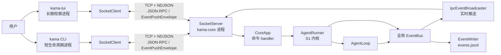
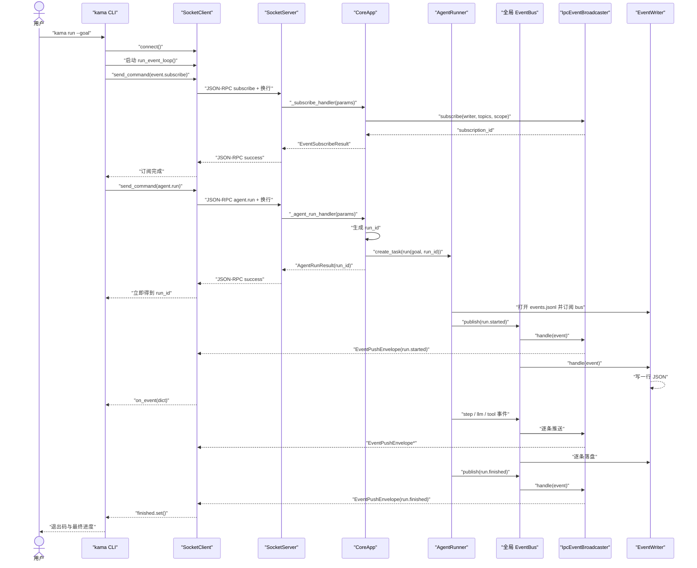
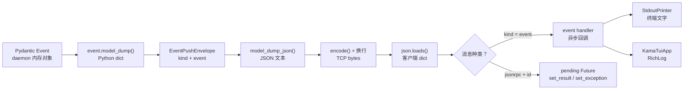
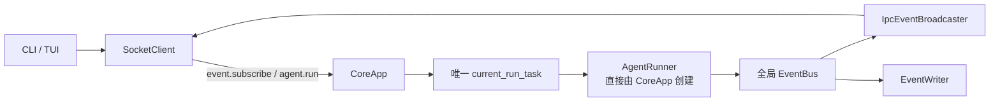
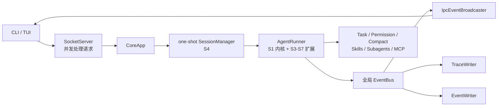

# KamaClaude S2 新手学习指南

> 适合已经走完 S0、S1，第一次接触双进程 Agent、双向 IPC、
> 事件订阅、断线回放和终端 UI 的读者。
>
> 对照资料：[语雀《S2-把事件流外化为 IPC》](https://www.yuque.com/caca-stfs7/ciualn/r0q244qogehmrmb4)
>
> S2 真实代码基线：`upstream/stage/s2`，提交
> `1d4d6ba9156e8e39f7e3ee9e731a72158ac59c7b`。
>
> S2 没有独立 tag。仓库现有阶段 tag 只有：
> `s0.0`、`s1.0.0`、`v1.0.0`。
>
> S2 的直接父提交（上一阶段基线）：
> `upstream/stage/s1`，提交 `76e299215685fd8c37b418a7a4babc84eb04474b`。

---

## 0. 先别慌：S2 其实只做一次“搬家”

S1 已经跑通最小 Agent 闭环：

```text
goal
→ LLM
→ tool_use
→ 执行工具
→ tool_result
→ LLM 最终回答
```

但原始 S1 有一个重要特点：

> AgentRunner、AgentLoop、LLM 调用和 CLI 都在同一个进程里。

S2 没有重写这套 Agent 内核。

它做的核心事情，是把 `AgentRunner` 从 CLI 进程搬进长期运行的
`kama-core` daemon，然后让 CLI 和 TUI 通过 TCP 与它通信：

```text
CLI 先订阅事件
    → CLI 发送 agent.run
    → daemon 立即返回 run_id
    → daemon 在后台运行 AgentRunner
    → EventBus 产生事件
    → broadcaster 把事件推到 TCP 连接
    → CLI / TUI 实时显示
    → run.finished 告诉客户端任务结束
```

学完 S2，只要你能讲清下面五件事，就已经抓住主线：

1. 为什么一定要“先订阅，再启动 run”；
2. 为什么 `agent.run` 的 RPC 返回不等于任务已经完成；
3. `SocketClient` 怎样区分 RPC 响应和服务端推送事件；
4. 同一个 Pydantic 事件怎样同时写入 `events.jsonl` 和推送给客户端；
5. 客户端断线后，`replay_from_run` 怎样补发已经落盘的历史事件。

S2 暂时不要求学习：

- S3 的 TaskManager、八种工具、Trace 和更完整的 TUI；
- S4 的 Session、thread、多轮消息和 notes；
- S5 的权限审批、参数模型和重试；
- S6 的上下文水位与 compact；
- S7 的 Skills、Subagents、MCP 和 extended thinking。

当前 `main` 已经包含 S3～S7。

所以你打开同名文件时，会看到比真实 S2 多很多代码。

这不是 S2 突然变得特别复杂，而是后续功能叠在了同一条主线上。

## 1. 本指南怎样做事实核查

本指南同时对照三类资料：

1. 当前 Chrome 中打开的语雀 S2 文档；
2. 真实阶段快照 `upstream/stage/s2`；
3. 当前仓库 `main`。

三者不一致时，采用以下优先级：

```text
真实 S2 阶段代码
    > 当前 main 中仍保留的真实行为
    > 语雀中的设计意图、概念说明或示例
```

原因是：

- 语雀最适合解释“为什么要这样设计”；
- 真实 S2 快照精确回答“S2 当时到底实现了什么”；
- 当前 `main` 用来回答“我现在打开的文件为什么不一样”。

本次核对得到的 Git 关系是：

```text
upstream/stage/s1
76e2992
    │
    └── upstream/stage/s2
        1d4d6ba
        无 S2 tag
```

真实提交说明是：

```text
feat(s2): 双进程架构——守护进程 + 客户端通过 TCP NDJSON 通信
```

比较两个阶段最直接的命令是：

```powershell
git diff --name-status upstream/stage/s1..upstream/stage/s2
```

真实结果是 36 个变更文件：

- 15 个行为核心、配置或生成文档文件；
- 1 个仓库说明文件 `CLAUDE.md`；
- 20 个测试文件。

后文会把这 36 个文件逐一分类。

## 2. S2 的学习目标

### 2.1 基础目标

完成 S2 后，你应该能：

- 区分 daemon、CLI、TUI 三个程序入口；
- 解释 S1 单进程与 S2 双进程的差异；
- 解释 JSON-RPC 响应与 EventPushEnvelope 的区别；
- 读懂 `SocketClient._pending` 中的 Future 映射；
- 解释 `EventSubscribeCommand` 的 topics、scope 和 replay；
- 说明 `ContextVar` 为什么能让订阅 handler 找到当前连接；
- 顺着一次 run 讲清完整 IPC 时序；
- 说明 `IpcEventBroadcaster` 的 topic 与 scope 过滤；
- 说明 `AgentRunner(bus=...)` 为什么是 S2 的关键改造；
- 说明 TUI 为什么只需要消费事件，而不直接 import AgentLoop。

### 2.2 进阶目标

如果想达到“可以向别人讲清楚”的程度，还应该能：

- 解释“RPC 立即返回 run_id，后台 task 继续运行”的并发关系；
- 解释为什么同一条 TCP 连接可以交错出现响应和事件；
- 区分 request id、run_id、subscription_id、tool_use_id；
- 说明 `fnmatch` 的 glob 匹配不是正则表达式；
- 说明 broadcaster 的“扇出”为什么不是并行调用；
- 解释 replay 与实时订阅之间存在怎样的窗口；
- 说明客户端断线时 pending Future 会怎样结束；
- 指出真实 S2 文档、实现和测试之间的边界；
- 区分当前 main 中 S3～S7 的后续增强。

## 3. 前置知识：只补到够读懂 S2

### 3.1 建议先完成 S0

S2 直接复用了 S0 的：

- `kama` 与 `kama-core` 双入口；
- TCP loopback；
- NDJSON 一行一帧；
- JSON-RPC 2.0 请求与响应；
- `SocketServer` 的 method → handler 路由；
- Pydantic 边界校验；
- host、port 和日志配置；
- 真实 daemon 集成测试 fixture。

如果你还分不清 TCP、NDJSON、JSON-RPC 和 Pydantic，
建议先回看 S0 指南。

### 3.2 必须理解 S1 的最小闭环

S2 没有替换：

- `ExecutionContext`；
- `AgentLoop`；
- `AnthropicProvider`；
- `ToolRegistry`；
- `ReadFileTool`；
- `EventBus`；
- `EventWriter`。

S2 只是改变这些组件被谁创建、在哪个进程运行、
事件还能流向哪里。

可以把 S1 理解为“发动机已经能转”，S2 则把发动机装进 daemon，
再给外部接上仪表盘和控制线。

### 3.3 请求、响应和推送

传统 JSON-RPC 是一问一答：

```text
客户端请求
→ 服务端处理
→ 服务端响应
```

S2 还需要服务端主动推送：

```text
daemon 内发生事件
→ 服务端不等客户端再次提问
→ 主动把事件写到已订阅的连接
```

因此同一连接上有两种消息：

| 消息 | 方向 | 识别方式 |
| --- | --- | --- |
| JSON-RPC 响应 | daemon → client | 顶层含 `jsonrpc` 和 `id` |
| 事件推送 | daemon → client | 顶层含 `kind: "event"` |

### 3.4 Future 是“未来会填上的结果”

客户端发送命令后，响应还没到。

它会先创建一个 Future：

```python
future = loop.create_future()
```

Future 可以理解为一张取货单：

- 现在先拿到单号；
- 真正结果稍后到；
- 调用方 `await` 这张单；
- 读循环收到对应响应后，把结果填进去。

S2 用请求 id 把 Future 存在字典里：

```text
request id
→ Future
```

这样即使多个请求交错返回，也能找到各自等待者。

### 3.5 Task 是已经开始运行的协程

直接：

```python
await runner.run(...)
```

会等整个 run 完成后才继续。

而：

```python
asyncio.create_task(runner.run(...))
```

会让 run 在后台继续，当前 handler 可以先返回 `run_id`。

这正是 S2 `agent.run` 能“立即响应”的原因。

### 3.6 asyncio.Event 是协程间的一次性信号

CLI 需要等 `run.finished`。

它创建：

```python
finished = asyncio.Event()
```

事件处理器看到 `run.finished` 后调用：

```python
finished.set()
```

主协程中的：

```python
await finished.wait()
```

才会继续清理连接并退出。

注意这里的 `asyncio.Event` 与项目里的业务 Event 不是一回事：

- `asyncio.Event` 是协程同步原语；
- `RunStartedEvent` 等是可序列化业务事件。

### 3.7 ContextVar 是“当前协程上下文里的变量”

`event.subscribe` handler 只收到 params：

```python
async def handler(params: dict[str, Any]) -> ...
```

但订阅时还必须知道：

> 应该把事件推给哪一条 TCP 连接？

S2 的 SocketServer 在调用 handler 前，把当前 writer 放进 `ContextVar`。

订阅 handler 再调用 `get_connection_writer()` 取回它。

这样不必把 writer 塞进所有 handler 的函数参数，也不必使用一个容易串线的全局变量。

### 3.8 fnmatch 是简单 glob 匹配

订阅 topics 可以写：

```text
run.*
step.*
tool.*
llm.token
```

`fnmatch.fnmatch("step.started", "step.*")` 会匹配成功。

它不是正则表达式。

常见符号是：

- `*`：任意长度字符；
- `?`：一个字符；
- `[abc]`：字符集合。

S2 的 topics 只需要理解 `*` 即可。

### 3.9 replay 是历史补发，不是重新执行

`replay_from_run` 不会重新调用 LLM，也不会重新执行工具。

它只是：

```text
读取已有 events.jsonl
→ 过滤 topic
→ 重新包装成 EventPushEnvelope
→ 发给客户端
```

所以 replay 展示的是历史事件记录，不是“重跑任务”。

### 3.10 Textual 是终端 UI 框架

S2 第一次加入 `textual`。

只需要先认识三个概念：

- `App`：整个 TUI 应用；
- `Label`：顶部连接状态；
- `RichLog`：滚动显示事件和输出。

S2 的 TUI 还没有输入框，也不能从界面直接发起多轮聊天。

它主要是一个实时事件观察器。

## 4. S2 相比 S1 增加了什么

| 维度 | S1 | S2 |
| --- | --- | --- |
| AgentRunner 位置 | CLI 进程 | kama-core daemon |
| CLI 职责 | 直接创建 Runner | 发 IPC 命令、收事件 |
| run 启动 | 等 `runner.run()` | RPC 立即返回 run_id，后台 task 执行 |
| EventBus | 每次 run 内部创建 | daemon 持有全局 bus |
| 事件消费者 | Printer + Writer | Broadcaster + Writer + 客户端 |
| 网络方向 | 主要请求/响应 | 请求/响应 + 服务端推送 |
| 客户端 | ping 手写 socket | 通用 `SocketClient` |
| 订阅 | 没有 | topics、scope、replay |
| 历史恢复 | 直接看文件 | 可从 TCP 回放 events.jsonl |
| TUI | 占位入口 | Textual 状态栏 + RichLog |
| daemon 管理 | 手动前台启动 | `kama core start/status/stop` |
| 重点测试 | Agent 内核 | IPC、扇出、双客户端、重连回放 |

最重要的变化不是“多了一个 UI”。

真正的架构变化是：

> S1 的进程内 EventBus，被接到了跨进程 IPC 边界。

## 5. 先建立一个生活化模型

可以把 S2 想成电视台直播：

| 项目概念 | 生活类比 |
| --- | --- |
| `kama-core` | 演播中心，节目制作一直在这里运行 |
| `AgentRunner` | 节目制作团队 |
| `EventBus` | 演播中心内部导播总线 |
| `EventWriter` | 把直播过程录制成档案 |
| `IpcEventBroadcaster` | 发射塔，把匹配内容送给观众 |
| `SocketServer` | 演播中心总机 |
| `SocketClient` | 电视接收器 |
| `event.subscribe` | 选择想看的频道 |
| `topics` | 频道类型，例如 run、tool、token |
| `scope` | 看全部节目，还是只看某个 run |
| `EventPushEnvelope` | 直播信号外包装 |
| `replay_from_run` | 回看已有录像 |
| `StdoutPrinter` | 把信号变成终端文字 |
| `KamaTuiApp` | 更友好的电视屏幕 |

这套类比有一个边界：

现实电视广播通常是真正并行发射。

真实 S2 的 broadcaster 是在一个循环里顺序 `await` 每个 writer，
所以“广播”表达的是逻辑扇出，不代表并行发送。

## 6. S2 双进程总图



图中最值得记住的是两条支路：

```text
事件 → EventWriter → 磁盘
事件 → IpcEventBroadcaster → TCP 客户端
```

同一个事件对象先在 daemon 进程内发布，再走向不同观察者。

## 7. S2 的 36 个变更文件

真实文件集来自：

```powershell
git diff --name-status upstream/stage/s1..upstream/stage/s2
```

### 7.1 行为核心：15 个文件

| 文件 | S2 作用 | 阅读建议 |
| --- | --- | --- |
| `pyproject.toml` | 新增 Textual 依赖和 Ruff 测试/脚本行宽例外 | 先看依赖差异 |
| `scripts/gen_protocol_doc.py` | 生成 S2 命令、响应和推送协议 | 理解生成关系 |
| `WIRE_PROTOCOL.md` | 生成后的 S2 wire 阅读版 | 只读，不手改 |
| `src/kama_claude/cli/commands/core.py` | daemon start/status/stop 与 PID 文件 | 精读 |
| `src/kama_claude/cli/commands/run.py` | 订阅、启动 run、消费事件 | 必须精读 |
| `src/kama_claude/cli/main.py` | 增加 `core` 命令和 run 分发 | 精读入口 |
| `src/kama_claude/core/app.py` | 全局 bus、broadcaster、run 与订阅 handler | 必须精读 |
| `src/kama_claude/core/bus/commands.py` | AgentRun 与 EventSubscribe 模型 | 精读 |
| `src/kama_claude/core/bus/envelope.py` | 新增 EventPushEnvelope | 精读 |
| `src/kama_claude/core/runner.py` | 允许注入外部 EventBus 和指定 run_id | 精读增量 |
| `src/kama_claude/core/transport/ipc_broadcaster.py` | topic/scope 过滤和事件扇出 | 必须精读 |
| `src/kama_claude/core/transport/socket_client.py` | 通用 RPC + 事件客户端 | 必须精读 |
| `src/kama_claude/core/transport/socket_server.py` | 暴露当前 writer，断线清订阅 | 精读增量 |
| `src/kama_claude/tui/__main__.py` | 解析 `--replay` 并启动 TUI | 快速看 |
| `src/kama_claude/tui/app.py` | Textual UI、重连、token 缓冲 | 精读 |

### 7.2 仓库说明：1 个文件

| 文件 | 作用 | 阅读建议 |
| --- | --- | --- |
| `CLAUDE.md` | 为开发代理补充仓库约束和注释规范 | 知道存在，不是 S2 运行时 |

`CLAUDE.md` 不参与程序执行。

学习 S2 时不需要把它当架构源码精读。

### 7.3 直接验证 S2 行为：6 个新增测试文件

| 文件 | 直接验证的 S2 能力 |
| --- | --- |
| `tests/integration/test_s2_dual_process.py` | 真实 daemon、run_id、广播、断线回放 |
| `tests/unit/test_ipc_broadcaster.py` | topic、scope、扇出、断线清理 |
| `tests/unit/test_socket_client.py` | Future 路由、RPC 错误、事件分发、断线退出 |
| `tests/unit/test_socket_server.py` | 连接断开时 unsubscribe、可选 broadcaster |
| `tests/unit/test_stdout_printer.py` | dict 事件如何显示到终端 |
| `tests/unit/test_tui_app.py` | token 缓冲、run 展示、颜色和未知事件 |

### 7.4 混合文件：`test_runner.py`

`tests/unit/test_runner.py` 原本是 S1 测试文件。

S2 在其中新增一个真正的行为测试：

```text
显式注入 external EventBus
→ 外部订阅者收到 run.started / run.finished
```

这项测试直接证明：

> AgentRunner 没有偷偷再创建一条独立 bus。

其余 Runner 测试主要仍验证 S1 生命周期。

### 7.5 主要只是补测试注释的 13 个既有文件

下面这些文件出现在 S1 → S2 的提交差异里，
但主要变化是给已有 S1 测试补充中文“功能 / 设计”注释：

| 文件 | 原有验证主题 |
| --- | --- |
| `tests/integration/test_ping_roundtrip.py` | S0 ping wire |
| `tests/integration/test_run_e2e.py` | S1 真实 LLM E2E |
| `tests/unit/test_commands_events.py` | 命令和事件模型 |
| `tests/unit/test_config_env.py` | 配置优先级 |
| `tests/unit/test_context.py` | ExecutionContext 消息 |
| `tests/unit/test_envelope.py` | JSON-RPC envelope |
| `tests/unit/test_event_bus.py` | 进程内事件广播 |
| `tests/unit/test_event_writer.py` | events.jsonl |
| `tests/unit/test_invocation.py` | 工具执行边界 |
| `tests/unit/test_llm_provider.py` | LLM Provider 翻译 |
| `tests/unit/test_loop.py` | AgentLoop 状态机 |
| `tests/unit/test_read_file.py` | ReadFileTool |
| `tests/unit/test_tool_registry.py` | 工具注册表 |

不要因为它们出现在 S2 提交里，就误称为“S2 新增了这些行为”。

Git 提交可以同时包含：

- 新功能；
- 新测试；
- 对旧测试的说明性注释。

### 7.6 为什么不手改 WIRE_PROTOCOL.md

`WIRE_PROTOCOL.md` 是生成物。

正确关系是：

```text
Pydantic 协议模型
    + scripts/gen_protocol_doc.py
    → WIRE_PROTOCOL.md
```

如果协议需要变化，应修改模型或生成脚本，再重新生成。

直接改 Markdown，下次生成会覆盖。

## 8. S2 的核心命令模型

### 8.1 AgentRunCommand

它描述启动任务需要的业务参数：

| 字段 | 含义 |
| --- | --- |
| `type` | 判别值 `agent.run`，有默认值 |
| `goal` | 用户交给 Agent 的目标 |

客户端在真实 wire 请求里主要发送：

```json
{
  "jsonrpc": "2.0",
  "id": "request-1",
  "method": "agent.run",
  "params": {
    "goal": "总结 README.md"
  }
}
```

注意：

- 顶层 `method` 决定 SocketServer 路由到哪个 handler；
- params 中没有显式 `type` 也能通过，因为模型字段有默认值；
- handler 再用 `AgentRunCommand.model_validate(params)` 校验 goal。

### 8.2 AgentRunResult

`agent.run` 不等待最终答案。

它立即返回：

```json
{
  "run_id": "20260518-142840-abc123"
}
```

这个结果只表示：

> daemon 已接受请求，并为后台任务分配了 run_id。

它不表示：

- LLM 已调用；
- 工具已执行；
- run 已成功；
- 最终回答已生成。

### 8.3 EventSubscribeCommand

核心字段：

| 字段 | 含义 | 示例 |
| --- | --- | --- |
| `topics` | 感兴趣的事件类型模式 | `["run.*", "tool.*"]` |
| `scope` | 事件所属 run 的范围 | `global` 或 `run:abc` |
| `replay_from_run` | 可选历史 run_id | `"20260518-..."` |

`topics` 负责“哪类事件”。

`scope` 负责“哪个 run”。

两者都通过才推送。

### 8.4 EventSubscribeResult

订阅成功返回：

| 字段 | 含义 |
| --- | --- |
| `subscription_id` | 本次订阅的唯一 ID |
| `replayed_count` | 本次订阅前已回放多少条历史事件 |

原始 S2 没有通过 subscription_id 取消订阅的命令。

它主要用于确认订阅已创建。

### 8.5 四种容易混淆的 ID

| ID | 生命周期 | 作用 |
| --- | --- | --- |
| JSON-RPC `id` | 一次请求/响应 | 把响应交给正确 Future |
| `run_id` | 一次 Agent 任务 | 串联目录、事件和状态 |
| `subscription_id` | 一次订阅注册 | 标识 broadcaster 中的订阅 |
| `tool_use_id` | 一次具体工具调用 | 配对 tool_use 与 tool_result |

它们不能互换。

## 9. EventPushEnvelope：服务端主动说话的外壳

S0 的 JSON-RPC 外壳适合“请求 → 响应”。

S2 需要 daemon 主动推送事件，因此增加：

```json
{
  "kind": "event",
  "event": {
    "type": "step.started",
    "run_id": "run-1",
    "step": 1,
    "ts": "..."
  }
}
```

为什么还要包一层？

因为客户端读到一行 JSON 后，需要先判断：

```text
这是 RPC 响应？
还是业务事件？
```

判断规则非常简单：

```text
有 jsonrpc
→ RPC 响应

kind == event
→ 服务端推送事件
```

EventPushEnvelope 里的 `event` 是普通 dict。

跨过 IPC 边界后，客户端不再持有原始 Pydantic 对象。

## 10. SocketClient：S2 的客户端中枢

### 10.1 它保存哪些状态

真实 S2 的核心字段：

| 字段 | 作用 |
| --- | --- |
| `_host` / `_port` | daemon 地址 |
| `_reader` | 从 TCP 读取字节 |
| `_writer` | 向 TCP 写字节 |
| `_pending` | request id → Future |
| `_event_handlers` | 收到事件后依次调用的回调 |

### 10.2 connect()

`connect()` 调用：

```python
asyncio.open_connection(host, port, limit=1MB)
```

得到 reader 和 writer。

这里的 `limit` 是 StreamReader 读取单帧时的缓冲限制。

原始 S2 客户端和服务端都限制为 1 MB。

### 10.3 send_command()

一次发送包含六步：

```text
1. 检查 writer 已连接
2. 生成 UUID request id
3. 构造 JsonRpcRequest
4. 创建 Future 并放入 _pending[id]
5. 写出 JSON + 换行
6. await Future
```

第 6 步不会自己读取 socket。

它依赖另一条已经运行的：

```python
client.run_event_loop()
```

去读取响应并填充 Future。

所以 CLI 必须先创建后台读循环：

```python
loop_task = asyncio.create_task(client.run_event_loop())
```

### 10.4 为什么需要 pending 字典

假设客户端先后发送：

```text
id=A  event.subscribe
id=B  agent.run
```

服务端响应到达时，读循环用响应 id 查找：

```text
A → subscribe Future
B → run Future
```

然后分别 `set_result()`。

没有这张表，就无法把交错到达的响应送回正确的 `await send_command()`。

### 10.5 run_event_loop()

它持续：

```text
readline()
→ 空 bytes？连接结束
→ _dispatch(line)
→ 继续下一行
```

如果连接关闭：

- 读循环退出；
- 未完成 Future 被 cancel；
- `_pending` 清空。

### 10.6 _dispatch()

分发逻辑：

```text
不是合法 JSON
→ 静默忽略

顶层有 jsonrpc
→ 找 pending Future
→ error 则 set_exception(IpcError)
→ success 则 set_result(result)

kind == event
→ 取 event dict
→ 顺序 await 每个 event handler
```

客户端事件 handler 同样是顺序执行，不是并行。

一个很慢的 handler 会拖慢后续消息读取。

### 10.7 IpcError

服务端返回 JSON-RPC error 时，
客户端把 code 和 message 转成 `IpcError`。

调用方可以：

```python
except IpcError as e:
    print(e.code)
```

这样 CLI 不需要自己反复解析 error dict。

## 11. CLI：一次 kama run 怎样进入 IPC

### 11.1 pyproject 入口没有变化

终端输入：

```powershell
kama run --goal "总结 README.md"
```

仍从：

```toml
kama = "kama_claude.cli.main:main"
```

进入。

### 11.2 cli.main 只负责解析和分发

`argparse` 得到：

```text
args.command == "run"
args.goal == "总结 README.md"
```

然后调用：

```python
cmd_run(args.goal, config)
```

### 11.3 cmd_run 是同步外壳

它用：

```python
asyncio.run(_run_async(goal, config))
```

托管异步 SocketClient。

按 `Ctrl+C` 时退出码是 130。

### 11.4 _run_async 的关键顺序

完整顺序是：

```text
创建 SocketClient
→ connect()
→ 创建 StdoutPrinter
→ 注册 on_event
→ 启动 run_event_loop 后台 task
→ 发送 event.subscribe
→ 等订阅响应
→ 发送 agent.run
→ 等立即返回的 run_id 响应
→ 等 run.finished 事件
→ 取消读循环
→ 关闭连接
→ 返回退出码
```

### 11.5 为什么先订阅

如果先发 `agent.run`：

```text
daemon 创建后台 task
→ task 很快发布 run.started
→ 此时客户端还没订阅
→ 最前面的事件丢失
```

所以 S2 固定：

```text
subscribe 成功
→ 再 agent.run
```

这不是代码风格偏好，而是避免竞态的协议顺序。

### 11.6 为什么还要等 run.finished

`agent.run` 的 RPC 很快只返回 run_id。

真正任务仍在 daemon 后台。

CLI 通过：

```python
await finished.wait()
```

等待事件流中的 `run.finished`。

如果 status 不是 success，退出码变成 1。

### 11.7 StdoutPrinter 为什么接收 dict

原始 S1 的 Printer 与 EventBus 同进程，可以收到 Pydantic 事件。

S2 的事件已经经历：

```text
Pydantic Event
→ JSON
→ TCP
→ json.loads
→ dict
```

因此 Printer 根据：

```python
event.get("type")
```

分发。

这正是跨进程边界带来的类型形态变化。

## 12. CoreApp：daemon 怎样接管 Runner

### 12.1 初始化时建立全局事件通道

真实 S2 的 `CoreApp.__init__()` 创建：

```text
EventBus
IpcEventBroadcaster
current_run_task
```

然后：

```python
bus.subscribe(broadcaster.handle)
```

从此 daemon 内发布到这条 bus 的事件，
都会先经过 broadcaster。

### 12.2 真实 S2 快照运行时共有三条路由

daemon 启动后注册：

| method | handler |
| --- | --- |
| `core.ping` | `_ping_handler` |
| `agent.run` | `_agent_run_handler` |
| `event.subscribe` | `_subscribe_handler` |

其中 `core.ping` 来自 S0，
S2 真正新增的是 `agent.run` 与 `event.subscribe`。

### 12.3 _agent_run_handler()

它先校验：

```python
AgentRunCommand.model_validate(params)
```

然后检查：

```text
current_run_task 是否存在且未完成？
```

若已有 run 在执行，原始 S2 抛出 RuntimeError。

若没有：

```text
生成 run_id
→ AgentRunner(config, bus=global_bus)
→ create_task(runner.run(goal, run_id=run_id))
→ 保存到 current_run_task
→ 立即返回 AgentRunResult(run_id)
```

### 12.4 为什么只有一个 current_run_task

原始 S2 明确限制 daemon 同时只跑一个 run。

好处是：

- 状态简单；
- global 订阅不会混入多个并发 run；
- CLI 只等第一个 run.finished 也暂时成立；
- 事件文件不容易互相污染。

这是一项阶段性简化，不是完整并发架构。

### 12.5 _subscribe_handler()

它完成：

```text
校验 EventSubscribeCommand
→ 从 ContextVar 取当前 writer
→ 如有 replay，先回放历史
→ broadcaster.subscribe(writer, topics, scope)
→ 返回 subscription_id 和 replayed_count
```

请注意真实顺序：

> 先 replay，后注册实时订阅。

这会带来后文说明的事件窗口。

## 13. ContextVar：订阅怎样绑定到当前连接

SocketServer 同时可能服务多个客户端。

每个客户端有自己的 writer。

在 `_handle_line()` 调用 handler 前：

```python
_writer_var.set(writer)
```

订阅 handler 内：

```python
writer = get_connection_writer()
```

于是：

```text
客户端 A 的 event.subscribe
→ A 的 writer

客户端 B 的 event.subscribe
→ B 的 writer
```

ContextVar 的值跟随当前异步上下文，
比“把最后一个连接存进普通全局变量”安全。

但原始 S2 没有保存 token 后 reset。

在当前调用模型中，每次 handler 前都会重新 set，
主路径仍能找到正确 writer。

## 14. IpcEventBroadcaster：事件怎样选择观众

### 14.1 _Subscription 保存什么

每一项订阅包含：

| 字段 | 作用 |
| --- | --- |
| `sub_id` | `sub-` + 8 位随机后缀 |
| `writer` | 目标 TCP 连接 |
| `topics` | 事件类型模式 |
| `scope` | global 或 run-specific |

Broadcaster 内部保存一个订阅列表。

### 14.2 subscribe()

每调用一次：

```text
生成新 subscription_id
→ 创建 _Subscription
→ append 到列表
```

同一个 writer 重复订阅不会覆盖旧订阅。

它会新增第二项。

### 14.3 topic 匹配

对事件：

```text
type = tool.call_started
```

以下会匹配：

```text
tool.*
*.call_started
*
```

以下不会匹配：

```text
run.*
llm.token
```

### 14.4 scope 匹配

`global`：

```text
所有 run_id 都通过
没有 run_id 的事件也通过
```

`run:abc`：

```text
只允许 event.run_id == "abc"
```

未知 scope：

```text
一律不匹配
```

### 14.5 handle() 的完整流程

```text
Pydantic event.model_dump()
→ 取 type 和 run_id
→ 复制当前 subscriptions 列表
→ topic 不匹配则跳过
→ scope 不匹配则跳过
→ 包装 EventPushEnvelope
→ writer.write(JSON + newline)
→ await writer.drain()
→ 写失败的 writer 记入 dead
→ 循环结束后统一 unsubscribe(dead)
```

为什么先记 dead、最后再删？

因为正在遍历订阅列表时直接修改它，
容易跳过后面的元素或让迭代行为变得难以推断。

### 14.6 unsubscribe()

它按 writer 身份移除该连接的全部订阅。

调用时机有两种：

- broadcaster 发送失败；
- SocketServer 发现客户端连接断开。

原始 S2 没有客户端主动发送的 `event.unsubscribe` 命令。

## 15. SocketServer 在 S2 增加了什么

S0 已经实现：

- 监听 TCP；
- 读取 NDJSON；
- 校验 JsonRpcRequest；
- method 路由；
- 成功/错误响应。

S2 的主要增量是：

1. 可选注入 `IpcEventBroadcaster`；
2. 用 ContextVar 暴露当前 writer；
3. 连接结束时调用 `broadcaster.unsubscribe(writer)`。

1 MB 单行限制在 S0/S1 已经存在，
S2 只是继续沿用，不属于本阶段新增能力。

### 15.1 原始 S2 仍逐行顺序处理

真实阶段代码是：

```python
await self._handle_line(line, writer)
```

即同一连接：

```text
读一行
→ handler 完成
→ 回响应
→ 再读下一行
```

`agent.run` handler 自己很快创建后台 task 并返回，
因此不会被整个 Agent run 长时间阻塞。

### 15.2 断线清订阅

连接处理的 finally 中：

```text
broadcaster.unsubscribe(writer)
→ writer.close()
→ wait_closed()
```

这样正常断线不会永久保留订阅。

### 15.3 业务参数错误怎样处理

SocketServer 先校验 JSON-RPC 外壳。

具体 handler 再校验业务 params。

原始 S2 捕获 handler 的 `ValidationError`，
但返回的是 `INVALID_REQUEST (-32600)`，
而不是已定义的 `INVALID_PARAMS (-32602)`。

这是阶段代码事实，不要按理想命名自行脑补。

## 16. AgentRunner 的 S2 改造

S1 的 Runner 总是自己创建 EventBus。

S2 构造器新增：

```python
bus: EventBus | None = None
```

运行时：

```text
传入 bus
→ 使用 daemon 的全局 bus

没有传入
→ 为兼容旧调用创建自己的 bus
```

这是一项很小、但非常关键的依赖注入。

如果 Runner 仍创建私有 bus：

```text
AgentLoop 发布事件
→ 私有 bus
→ daemon broadcaster 完全收不到
```

### 16.1 run_id 也由外部注入

S2 的 CoreApp 要先把 run_id 返回给 RPC 客户端，
再启动 Runner。

因此 Runner 支持：

```python
run(goal, run_id=预先生成的ID)
```

这样 RPC 结果、事件和目录都使用同一个 ID。

### 16.2 EventWriter 怎样接入全局 bus

每次 run：

```text
创建 events.jsonl
→ EventWriter.subscribe(global_bus)
→ 发布 run.started
→ 执行 AgentLoop
→ 发布 run.finished
→ 关闭 writer
```

CoreApp 初始化时，broadcaster 已先订阅 global bus。

Runner 运行时，writer 再订阅。

EventBus 按订阅顺序逐个 await：

```text
事件
→ broadcaster.handle
→ writer.handle
```

这是逻辑上的两个观察者。

并不是两个操作并行发生。

## 17. 一次 run 的完整时序



这张图里有两个不同的“完成”：

```text
agent.run 的 JSON-RPC success
→ 命令已接受

run.finished 事件
→ 后台任务已结束
```

## 18. 同一连接怎样同时承载响应和事件

TCP 连接本身只是连续字节流。

NDJSON 用换行恢复每条消息边界。

一条连接可能看到：

```text
{"jsonrpc":"2.0","id":"A","result":{...}}
{"kind":"event","event":{"type":"run.started",...}}
{"kind":"event","event":{"type":"llm.token",...}}
{"jsonrpc":"2.0","id":"B","result":{...}}
{"kind":"event","event":{"type":"run.finished",...}}
```

SocketClient 每读一行，就检查顶层形状。

因此“响应”和“事件”可以交错，
只要每条都能被唯一识别。

不要假设：

```text
发一次命令
→ 后面只可能紧跟一个响应
```

S2 的连接已经是双向、多消息的长期通道。

## 19. 数据在各层怎样变形



最容易混淆的三点：

1. EventBus 传的是 Pydantic 对象；
2. IPC 传的是 JSON 字节；
3. CLI/TUI 最终收到的是 dict。

类型发生变化，不代表事件语义发生变化。

## 20. replay：断线后怎样补历史

### 20.1 客户端请求

TUI 可传：

```powershell
kama-tui --replay RUN_ID
```

最终订阅 params 多出：

```json
{
  "replay_from_run": "RUN_ID"
}
```

### 20.2 daemon 回放

真实 S2：

```text
events_file(run_id)
→ 文件不存在则返回 0
→ read_text()
→ splitlines()
→ 跳过空行
→ json.loads()
→ 跳过坏 JSON
→ fnmatch topic
→ 包装 EventPushEnvelope
→ 写入当前 writer
→ 最后 drain()
→ 返回 count
```

### 20.3 scope 是否参与 replay

真实 `_replay_events()` 只接收：

- run_id；
- writer；
- topics。

它没有接收 scope。

因为 replay_from_run 本身已经指定了一个历史 run。

实时订阅注册后，scope 才由 broadcaster 使用。

### 20.4 replay 与实时订阅的窗口

真实顺序是：

```text
先读取并发送历史
→ 后注册实时 subscription
```

若 run 正在进行：

```text
读取文件结束
→ 新事件恰好发布
→ 实时订阅尚未注册
```

这条事件可能既不在已读取的历史中，
也没有被实时 broadcaster 接住。

所以原始 S2 replay 不是严格无缝续传。

### 20.5 Windows 编码边界

真实 S2 使用：

```python
path.read_text()
```

没有显式 `encoding="utf-8"`。

在默认编码不是 UTF-8 的 Windows 环境，
如果事件文件包含中文，回放存在解码风险。

当前学习改造只记录，不修改阶段行为。

## 21. TUI：S2 的实时事件屏幕

### 21.1 pyproject 新增 Textual

真实 S2 新增：

```toml
"textual>=0.75"
```

它是 S2 唯一真正新增的运行时依赖。

### 21.2 S2 的界面只有两块

```text
顶部 Label
→ connecting / connected / disconnected

下方 RichLog
→ run / step / tool / token / usage / log
```

这里的 `log` 只表示 TUI 写好了 `log.line` 渲染分支。
真实 S2 和当前 main 都找不到 `LogLineEvent(...)` 的构造或发布点，
因此正常 S2 主线不会收到这类事件。
`CoreStartedEvent` 也同样只有模型，没有实际发布点。

没有：

- 输入框；
- 会话列表；
- 权限弹窗；
- 多轮聊天；
- Skills 展示；
- Subagent 面板。

这些是当前 main 的后续功能。

### 21.3 连接循环

`_socket_loop()`：

```text
创建 SocketClient
→ connect
→ 失败则显示 not connected
→ sleep 2 秒
→ 重试
```

连接成功：

```text
显示 connected
→ 启动 client.run_event_loop
→ 注册 on_event
→ event.subscribe
→ 等读循环结束
```

断开后：

```text
取消未结束 loop_task
→ flush token
→ close client
→ 显示 disconnected
→ sleep 2 秒
→ 重连
```

自动重连不会自己推断当前 run，也不会自动补齐历史。
只有启动时显式传入 `kama-tui --replay RUN_ID`，
每次连接才会请求 replay。
这个参数会在后续重连时继续保留，
所以同一段历史也可能被重复展示。

### 21.4 为什么需要 token buffer

LLM token 可能非常碎：

```text
"Hel"
"lo"
" "
"world"
```

如果每个 token 都调用一次 `RichLog.write()`，
可能变成许多零碎日志行。

S2 先累积：

```text
_token_buf += token
```

遇到下一条非 token 事件时再整体写入。

### 21.5 未知事件怎样处理

`_handle_event()` 没有最终 else。

未知 type 会被静默忽略。

这样后续 daemon 增加新事件时，
旧 TUI 不会因为不认识它就崩溃。

## 22. core start、status、stop

### 22.1 kama core start

先尝试连接 host:port。

若连接成功：

```text
already running
```

若连接失败：

```text
subprocess.Popen(
    python -m kama_claude.core,
    start_new_session=True,
    stdout=DEVNULL,
    stderr=DEVNULL
)
→ 写 PID 文件
```

### 22.2 kama core status

它只尝试：

```python
asyncio.open_connection(host, port)
```

连接成功就报告 running。

它没有发送 `core.ping`。

因此它证明的是：

> 目标端口有人接受 TCP 连接。

它不能严格证明：

> 对方一定是健康的 KamaClaude daemon。

### 22.3 kama core stop

它：

```text
读取 PID 文件
→ os.kill(pid, 0) 检查进程
→ os.kill(pid, SIGTERM)
→ 删除 PID 文件
```

### 22.4 原始 S2 的 PID 路径

真实阶段使用：

```text
Path.home() / ".kama" / "kama-core.pid"
```

在 Windows 上通常落到用户主目录，往往位于 C 盘。

当前仓库规范要求运行数据进入项目 `.kama/`，
所以当前 main 已改成项目内路径。

学习原始 S2 时要知道历史事实，
实际运行当前仓库时要遵守现在的项目约束。

## 23. 测试数量怎样正确理解

真实 `upstream/stage/s2` 中：

```text
tests/unit/ 测试函数：106
test_s2_dual_process.py：3
全仓库测试函数：113
```

113 的构成是：

```text
106 个单元测试
+ 3 个 S2 重点集成测试
+ 3 个继承自 S0 的 ping 集成测试
+ 1 个继承自 S1 的真实 LLM E2E
= 113
```

因此语雀所说“106 单测 + 3 个重点集成”是准确的。

它强调的是 S2 的主要验收集合，
不是说仓库里只有 109 个测试函数。

当前 main 已加入更多阶段测试。

不能拿当前总数反推真实 S2 当时的测试数量。

## 24. 六个直接 S2 测试文件验证什么

### 24.1 test_ipc_broadcaster.py

它验证：

- 匹配 topic 的事件被包装并写入；
- 没有订阅时不写；
- `step.*` 只匹配 step 事件；
- global scope 接收不同 run_id；
- `run:<id>` 过滤其他 run；
- unsubscribe 后不再推送；
- drain 抛连接错误后移除死连接。

它使用 MagicMock writer，
不启动真实 TCP server。

### 24.2 test_socket_client.py

它使用 `asyncio.start_server(..., port=0)` 创建内存 mock server，
验证：

- send_command 返回 result；
- JSON-RPC error 变成 IpcError；
- kind=event 路由给 handler；
- 服务端关闭后读循环不挂起。

它不依赖真实 daemon，也不调用 LLM。

### 24.3 test_socket_server.py

两个用例验证：

- 客户端断开后调用 broadcaster.unsubscribe；
- 不传 broadcaster 时 server 仍能启动停止。

第二项保证 S0 旧调用方式向后兼容。

### 24.4 test_stdout_printer.py

它通过 `capsys` 验证：

- run_id；
- step 编号；
- token 内联与补换行；
- 工具名和 params；
- 最终 status 与 steps。

它不检查精确耗时，
避免依赖真实时钟。

### 24.5 test_tui_app.py

它用 `_FakeLog` 替代真实 RichLog，验证：

- token 累积并一次 flush；
- run.started 显示 run_id 和 goal；
- success/failed 使用不同颜色；
- 未知事件静默忽略。

它没有启动完整 Textual 屏幕，也没有验证重连循环。

### 24.6 test_runner.py 的注入用例

它显式创建外部 EventBus，订阅收集器，
再构造：

```python
AgentRunner(..., bus=external_bus)
```

最终断言外部 bus 收到 run.started 和 run.finished。

这正面验证了 CoreApp 全局 bus 注入所需的 Runner 接线。

## 25. 三个 S2 重点集成测试

### 25.1 agent.run 返回 run_id 并广播 started

测试会：

```text
连接真实 daemon 子进程
→ 订阅 run.*
→ 发送 agent.run
→ 得到非空 run_id
→ 等 run.started
→ 比较事件 run_id 与 RPC run_id
→ 比较 goal
```

`run.started` 在真正 LLM 调用前发布，
所以这项测试不需要 API key。

### 25.2 两个客户端都收到广播

测试会：

```text
连接 client1
→ 连接 client2
→ 两者都订阅 run.*
→ client1 发 agent.run
→ gather 等两个 asyncio.Event
```

它证明一条事件可以扇出到两个独立 TCP 客户端。

它没有证明 broadcaster 并行发送。

### 25.3 断线后 replay

第一阶段：

```text
client1 启动 run
→ 等 run.started
→ 断开
```

第二阶段：

```text
client2 重连
→ replay_from_run=run_id
→ 断言 replayed_count > 0
```

它证明至少有历史事件从 events.jsonl 被读取。

它没有逐条断言回放事件内容，也没有覆盖正在运行时的无缝续传窗口。

## 26. 测试没有覆盖什么

下面是证据边界，不等于代码一定错误：

- 没有测试 replay 读取中文 UTF-8 文件的 Windows 行为；
- 没有测试“回放后、注册前”恰好发布事件的竞态；
- 没有测试同一个 writer 重复订阅导致重复推送；
- 没有客户端主动 unsubscribe 命令测试，因为命令不存在；
- 没有测试 global scope 在并发 run 下的串流问题；
- 没有测试 CLI 在 run.finished 前断线后的永久等待；
- 没有测试 EventBus 中 EventWriter handler 长期累积；
- 没有测试两个并发 Runner 是否互相写事件；
- 没有测试 `core status` 连接到了非 KamaClaude 服务；
- 没有测试文档中的 `-32000` 真正由服务端返回；
- 没有测试业务 ValidationError 返回 `-32602`；
- 没有测试 TUI 的两秒断线重连循环；
- 没有测试超长帧边界；
- 没有测试 unknown JSON 行对 pending Future 的影响；
- 没有测试 CLI 是否用 RPC 返回的 run_id 过滤事件。

测试没覆盖，表示：

> 当前自动化证据不能证明这些边界。

学习改造只记录，不擅自修改原有行为。

## 27. 语雀与真实 S2 一致的关键设计

| 语雀说明 | 真实 S2 |
| --- | --- |
| Runner 搬到 daemon | 一致 |
| CLI 变成 IPC 客户端 | 一致 |
| 先订阅再启动 run | 一致 |
| agent.run 立即返回 run_id | 一致 |
| EventBus 同时服务落盘和外推 | 逻辑职责一致 |
| topics 支持通配 | 使用 fnmatch |
| scope 支持 global 与 run-specific | 一致 |
| replay 读取 events.jsonl | 一致 |
| TUI 自动重连 | 两秒重试 |
| token 需要缓冲 | 一致 |
| S2 有 106 单测与 3 个重点集成 | 一致 |

其中“同时服务”应理解为：

```text
同一事件流扇出到多个观察者
```

不应理解为：

```text
所有观察者并行执行
```

## 28. 真实 S2 的事实缺口与边界

这一节非常重要。

它记录文档、协议、实现和测试之间的差异，
不在新手注释改造中修复。

### 28.1 routing 说明与真实路由不一致

生成文档写：

> params 内的 type 字段用于 routing。

真实 SocketServer 使用：

```python
handler = handlers.get(req.method)
```

即顶层 `method` 路由。

而生成示例的 params 还省略了 type。

之所以仍能校验，是因为命令模型的 type 字段有默认值。

### 28.2 -32000 只出现在文档

WIRE_PROTOCOL 列出：

```text
-32000 Application Error
例如已有 run 正在进行
```

但原始 `_agent_run_handler()` 只是抛：

```python
RuntimeError("a run is already in progress")
```

SocketServer 的普通 Exception 分支把它变成：

```text
-32603 Internal Error
```

真实实现没有产生 `-32000`。

### 28.3 INVALID_PARAMS 定义了但未接入

协议常量有：

```text
-32602 INVALID_PARAMS
```

但 handler 的 Pydantic ValidationError 被映射到：

```text
-32600 INVALID_REQUEST
```

所以不能只看常量名推断实际 wire 行为。

### 28.4 Pong 示例版本漂移

生成文档示例写：

```text
server_version = 0.2.0
```

真实包：

```python
__version__ = "0.0.1"
```

真正 ping 结果来自包常量，实际是 0.0.1。

### 28.5 Windows signal 不兼容

原始 S2 直接调用：

```python
loop.add_signal_handler(...)
```

Windows 默认事件循环通常不支持它。

当前 main 已增加同步 `signal.signal()` 回退。

这是当前修复，不应倒推为真实 S2 当时已有。

### 28.6 replay 有丢事件窗口

原始订阅顺序：

```text
先 replay
→ 后 subscribe realtime
```

进行中的 run 可能在两步之间发布事件。

这条事件可能丢失。

### 28.7 replay 未显式指定 UTF-8

`Path.read_text()` 使用平台默认编码。

Windows 中文事件回放存在风险。

### 28.8 EventBus 没有 unsubscribe

每次 Runner：

```text
新建 EventWriter
→ writer.subscribe(global_bus)
→ run 后关闭 writer
```

但 EventBus 中 handler 不会移除。

关闭后的 EventWriter handle 通常只会 no-op，
但订阅列表会累积。

### 28.9 当前并发 run 可能互相写事件

原始 S2 只有一个 current_run_task，
暂时避开多个 Runner 同时订阅全局 bus。

当前 main 已支持更多任务形态。

多个 EventWriter 若同时留在同一全局 bus，
可能收到彼此 run 的事件并写进各自 events.jsonl。

### 28.10 当前 CLI 使用 global 且忽略 run_id

真实 S2 `_run_async()`：

```text
scope = global
agent.run 的 result 没有保存用于过滤
任何 run.finished 都会 finished.set()
```

在原始“同一时刻只有一个 run”的假设下暂时成立。

当前支持更多运行形态后，其他 run.finished 可能让 CLI 提前结束。

### 28.11 run.finished 前断线可能永久等待

如果读循环因断线退出：

- pending Future 会被取消；
- 但若 RPC 已完成，CLI 已进入 `await finished.wait()`；
- 没有逻辑在断线时 set finished 或抛出错误。

因此 CLI 可能一直等不到 run.finished。

### 28.12 broadcaster 是顺序 await

它对订阅者逐个：

```python
write()
await drain()
```

慢客户端可能拖慢后面的客户端，
还可能拖慢整个 EventBus 发布链。

### 28.13 重复订阅会重复推送

同一 writer 每调用一次 subscribe，
都会 append 新 _Subscription。

相同 topics/scope 的重复订阅，
可能让同一事件被写多次。

### 28.14 没有 unsubscribe 命令

只能在：

- 连接断开；
- 写入失败；

时按 writer 清理。

客户端不能只取消某一个 subscription_id。

### 28.15 core status 只探测端口

连接成功不代表对方一定是 KamaClaude。

真实 status 没有发送 ping 验证协议和版本。

### 28.16 自动化测试没有覆盖以上边界

这些问题大多没有对应测试。

所以指南必须把“已实现的正常路径”与“未证明的边界”分开。

### 28.17 原始 daemon shutdown 不等待活跃 run

真实 S2 收到退出信号后只调用 `server.stop()`，
不会主动取消或等待 `_current_run_task`。

因此 daemon shutdown 不保证后台 run 完整收尾。
当前 main 对 `_running_runs` 做 cancel 与 gather，
属于后续阶段补上的生命周期处理。

### 28.18 阶段内的 CLAUDE.md 也有过时信息

真实 S2 的 `CLAUDE.md` 仍写着：

- 客户端通过 Unix domain socket 连接；
- commands 只有 Ping；
- events 只有 CoreStarted。

但同一个阶段的真实代码已经使用 TCP，
也已经加入 AgentRun、EventSubscribe 和完整运行事件模型。

这再次说明：

> 辅助说明文件可以提供阅读线索，但冲突时必须以阶段源码和测试为准。

## 29. 当前 main 与原始 S2 为什么不一样

### 29.1 原始 S2



### 29.2 当前 main



### 29.3 agent.run 路径变化

原始 S2：

```text
CoreApp._agent_run_handler
→ AgentRunner(config, bus)
→ create_task(runner.run)
```

当前 main：

```text
CoreApp._agent_run_handler
→ one-shot SessionManager
→ SessionManager.send_message
→ AgentRunner.run_and_capture
```

因此当前 handler 中看不到与原始 S2 完全一样的直接创建方式。

### 29.4 单任务变多任务

原始 S2：

```text
_current_run_task
→ 同时只允许一个 run
```

当前 main：

```text
_running_runs 等任务集合
→ 支持更多并发运行形态
```

这会让原始 CLI 的 global 订阅假设变得不再稳固。

### 29.5 SocketServer 变化

| 项目 | 原始 S2 | 当前 main |
| --- | --- | --- |
| 单帧上限 | 1 MB | 64 MB |
| 同连接命令 | 逐行 await | 每行 create_task |
| 错误扩展 | 普通异常 → -32603 | 新增 HandlerError，仍保留普通异常 → -32603 |
| Trace | 没有 | 有命令 trace |
| writer 管理 | 连接 finally | active writers 集合 |
| 目的 | 最小 IPC | 长任务、权限响应、MCP 大结果 |

当前按行 create_task 是后续并发需求。

学习 S2 时先按原始的顺序读循环理解。

### 29.6 SocketClient 变化

| 项目 | 原始 S2 | 当前 main |
| --- | --- | --- |
| 单帧上限 | 1 MB | 64 MB |
| 超长行 | 没有专门恢复 | 增加 LimitOverrun 处理 |
| 用途 | run 与 TUI | chat/session/permission 等更多命令 |

### 29.7 TUI 变化

原始 S2 TUI：

- Label 状态栏；
- RichLog；
- 只观察事件；
- 两秒重连；
- 可 replay；
- `q` 退出。

当前 TUI 还包括：

- 多轮输入；
- 多种 widget；
- Session；
- 权限交互；
- Skills；
- Subagents；
- MCP；
- 更复杂的连接和状态管理。

学习 S2 时只找“连接 → 订阅 → 事件展示”这条祖先主线。

### 29.8 PID 和 Windows 变化

| 项目 | 原始 S2 | 当前 main |
| --- | --- | --- |
| PID | `Path.home()/.kama` | 项目 `.kama/` |
| daemon signal | 仅 add_signal_handler | Windows fallback |
| 默认配置 / 日志 | 用户目录 `~/.kama` | 项目 `.kama/` |
| run 事件文件 | 项目 `runs/<run_id>/` | 通常为项目 `.kama/sessions/<sid>/runs/<run_id>/` |

实际动手必须遵守当前 `AGENT.md`，
不要照搬历史 PID 路径。

### 29.9 replay 路径变化

原始 S2 只找：

```text
runs/<run_id>/events.jsonl
```

当前 main 的 CLI run 通常位于：

```text
.kama/sessions/<session_id>/runs/<run_id>/events.jsonl
```

当前 replay 已增加对 session 目录的兼容查找。

### 29.10 当前协议生成器的边界

当前生成结果已经包含 Session 相关模型。

但生成器并未完整覆盖：

- `permission.respond`；
- `session.compact`。

即使运行 `--check` 通过，
也只能证明：

> 当前生成文件与当前生成器一致。

不能证明生成器已经枚举所有真实协议。

## 30. 按文件区分“现在学”和“先跳过”

| 文件 | S2 现在学 | 当前 main 先跳过 |
| --- | --- | --- |
| `cli/main.py` | run/core 分发 | chat/trace 等后续命令 |
| `cli/commands/run.py` | 订阅、run、finished | 无实质 S3+ 主干；global/run_id 并发问题只作为缺口记录 |
| `cli/commands/core.py` | start/status/stop | 当前项目路径修复需知道但不当原始行为 |
| `core/app.py` | bus、broadcaster、S2 三路由 | Session、Permission、MCP、Trace |
| `bus/commands.py` | AgentRun、Subscribe | Session、Permission 等模型 |
| `bus/envelope.py` | EventPushEnvelope | HandlerError 是后续增强 |
| `runner.py` | bus/run_id 注入 | Task、Session、Trace、Subagent、MCP |
| `ipc_broadcaster.py` | 订阅、过滤、推送与死连接清理 | TraceWriter 注入、`_now` 和 IPC push trace |
| `socket_client.py` | pending、dispatch、event | 64MB 与更多命令场景 |
| `socket_server.py` | ContextVar、断线清订阅 | create_task、trace、active writers |
| `tui/__main__.py` | `--replay` 祖先入口 | 当前更多启动配置 |
| `tui/app.py` | 连接、订阅、展示、重连 | 多轮 UI、权限、Skills、Subagents |

## 31. 当前 main 的阶段增量速查

| 阶段 | 在 S2 主线上增加什么 |
| --- | --- |
| S3 | TaskManager、八种工具、Trace、完整 TUI 基础 |
| S4 | Session、多轮历史、notes、one-shot session 外壳 |
| S5 | 权限审批、参数模型、错误分类与重试 |
| S6 | global/project context、上下文水位、compact |
| S7 | Skills、Subagents、MCP、thinking blocks |

看到陌生代码时，可以问：

> 去掉它以后，“订阅 → run RPC → daemon Runner → 事件推送”是否仍成立？

如果仍成立，它大概率不是 S2 必学主干。

## 32. 推荐阅读顺序

### 第一轮：只看全景，约 30 分钟

读：

1. 本指南第 0、4、5、6 节；
2. `pyproject.toml` 的 scripts 和 Textual 依赖；
3. `cli/main.py` 的 run/core 分支；
4. 原始 S2 的 `cli/commands/run.py` 顶层；
5. 原始 S2 的 `core/app.py` 顶层。

目标：

> 能画出 CLI → SocketClient → CoreApp → Runner → EventBus → Client。

暂时不要钻 Future 和 Textual。

### 第二轮：追一条 RPC，约 60 分钟

读：

1. `bus/envelope.py`；
2. `bus/commands.py` 的 S2 模型；
3. `socket_client.py` 的 send_command；
4. `socket_server.py` 的 _handle_line；
5. `core/app.py` 的 _agent_run_handler。

目标：

> 能解释 request id 怎样找到 pending Future。

### 第三轮：追事件，约 75 分钟

读：

1. `runner.py` 的 bus 注入；
2. `events/bus.py`；
3. `ipc_broadcaster.py`；
4. `socket_client.py` 的 _dispatch；
5. `test_ipc_broadcaster.py`；
6. `test_socket_client.py`。

目标：

> 能讲清 Pydantic Event 到客户端 dict 的每次变形。

### 第四轮：追订阅和 replay，约 60 分钟

读：

1. `EventSubscribeCommand`；
2. `_subscribe_handler()`；
3. `_replay_events()`；
4. broadcaster 的 topic/scope；
5. `test_s2_dual_process.py` 第三个用例。

目标：

> 能区分 topic、scope、replay_from_run。

### 第五轮：看 CLI 与 TUI，约 60 分钟

读：

1. `StdoutPrinter`；
2. `test_stdout_printer.py`；
3. `tui/__main__.py`；
4. `tui/app.py`；
5. `test_tui_app.py`。

目标：

> 能解释为什么两个前端都只消费 dict 事件。

### 第六轮：看差异和边界，约 60 分钟

最后读：

1. 本指南第 28～31 节；
2. 当前 main 对应文件中的 S2 注释；
3. 当前测试；
4. 真实 S2 WIRE_PROTOCOL 的相关章节。

目标：

> 能明确说出“真实 S2 做了什么”和“当前 main 后来改了什么”。

## 33. 安全查看真实 S2

当前工作树已有学习注释和其他修改。

不建议为了对照而直接 checkout 或 switch。

只读查看历史文件：

```powershell
git show upstream/stage/s2:src/kama_claude/core/app.py
```

查看 SocketClient：

```powershell
git show upstream/stage/s2:src/kama_claude/core/transport/socket_client.py
```

查看 TUI：

```powershell
git show upstream/stage/s2:src/kama_claude/tui/app.py
```

列出阶段增量：

```powershell
git diff --name-status upstream/stage/s1..upstream/stage/s2
```

比较单个历史文件与当前 main：

```powershell
git diff upstream/stage/s2..main -- `
  src/kama_claude/core/transport/socket_client.py
```

查看真实提交：

```powershell
git show --stat --oneline upstream/stage/s2
```

确认 tag：

```powershell
git tag --list
```

这些命令不会修改工作树。

## 34. 动手实验前的环境准备

所有命令使用仓库指定环境：

```powershell
Set-Location "E:\工作\agent项目\KamaClaude"
conda activate "E:\conda_envs\kamaclaude"
```

执行可能产生缓存的命令前：

```powershell
$env:TEMP = "$PWD\.tmp"
$env:TMP = "$PWD\.tmp"
$env:TMPDIR = "$PWD\.tmp"
$env:PIP_CACHE_DIR = "$PWD\.cache\pip"
$env:UV_CACHE_DIR = "$PWD\.uv-cache"
$env:CONDA_PKGS_DIRS = "$PWD\.cache\conda-pkgs"

New-Item -ItemType Directory -Force `
  ".tmp", ".cache\pip", ".cache\conda-pkgs", ".uv-cache" | Out-Null
```

不要把 PID、日志、测试产物或临时文件写到 C 盘。

不要为了做实验切换到历史分支覆盖当前修改。

## 35. 可以跟着做的动手实验

### 实验 1：确认真实阶段关系

```powershell
git log -1 --oneline upstream/stage/s1
git log -1 --oneline upstream/stage/s2
git diff --stat upstream/stage/s1..upstream/stage/s2
```

观察：

- S1 提交是否为 `76e2992`；
- S2 提交是否为 `1d4d6ba`；
- diff 是否为 36 个文件。

### 实验 2：只读比较 Runner 的搬家接口

```powershell
git diff upstream/stage/s1..upstream/stage/s2 -- `
  src/kama_claude/core/runner.py
```

找出：

- `bus` 参数；
- `run_id` 参数；
- “外部 bus 或内部 bus”的选择。

思考：

> 如果不注入 bus，broadcaster 为什么收不到 AgentLoop 事件？

### 实验 3：运行 broadcaster 单元测试

```powershell
python -m pytest tests/unit/test_ipc_broadcaster.py -v
```

重点看：

- topic glob；
- run scope；
- dead writer；
- unsubscribe。

### 实验 4：运行 SocketClient 单元测试

```powershell
python -m pytest tests/unit/test_socket_client.py -v
```

思考：

- 为什么 mock server 必须回传相同 id？
- 为什么 loop_task 要和 send_command 并发？
- server 关闭后 pending Future 会怎样？

### 实验 5：运行 SocketServer 增量测试

```powershell
python -m pytest tests/unit/test_socket_server.py -v
```

观察：

- broadcaster 是可选依赖；
- 连接断开怎样触发 unsubscribe；
- 为什么测试使用随机空闲端口。

### 实验 6：运行展示层测试

```powershell
python -m pytest `
  tests/unit/test_stdout_printer.py `
  tests/unit/test_tui_app.py `
  -v
```

比较：

- StdoutPrinter 直接 print；
- 当前 TUI 用 `LLMStreamBlock` 累积 token，真实 S2 才是缓冲后写 RichLog；
- 当前测试还包含很多 S3+ UI 行为，学习 S2 只追 token、run 和未知事件的祖先语义；
- 两者都只按 dict 的 type 分发。

### 实验 7：运行 Runner 外部 bus 测试

```powershell
python -m pytest `
  tests/unit/test_runner.py::test_injected_bus_receives_events `
  -v
```

目标：

> 用一个最小测试证明 daemon 的全局 EventBus 真正接入 Runner。

### 实验 8：运行三个 S2 双进程集成测试

```powershell
python -m pytest tests/integration/test_s2_dual_process.py -v
```

它会启动真实 daemon 子进程。

观察：

- RPC run_id；
- 两客户端广播；
- 断线回放。

这些用例只等待 LLM 调用前的 run.started，
通常不需要真实 API key。

### 实验 9：只运行第一个集成用例

```powershell
python -m pytest `
  tests/integration/test_s2_dual_process.py::test_agent_run_returns_run_id_and_emits_started `
  -v
```

在代码旁手画：

```text
subscribe response
→ agent.run response
→ run.started push
```

注意响应与 push 是不同消息。

### 实验 10：检查协议文档同步

```powershell
python scripts/gen_protocol_doc.py --check
```

若通过，只能说明：

```text
WIRE_PROTOCOL.md
与当前生成器输出一致
```

它不自动证明生成器覆盖所有命令，也不证明示例版本正确。

### 实验 11：查看原始协议缺口

```powershell
git show upstream/stage/s2:WIRE_PROTOCOL.md |
  Select-String -Pattern "routing", "0.2.0", "-32000"
```

再对照：

```powershell
git show upstream/stage/s2:src/kama_claude/core/transport/socket_server.py
```

回答：

- 真正用什么字段路由？
- RuntimeError 实际变成什么错误码？
- ping 版本实际来自哪里？

### 实验 12：观察当前 daemon 管理命令

```powershell
kama core status
```

若准备启动：

```powershell
kama core start
kama core status
```

结束后：

```powershell
kama core stop
```

注意：

- 当前 main 的 PID 和日志应在项目 `.kama/`；
- status 只探测端口；
- 后台 stderr 被重定向，启动问题要结合 `.kama/logs/` 排查。

### 实验 13：观察当前 TUI

先启动 daemon：

```powershell
kama-core
```

另一个终端：

```powershell
kama-tui
```

注意当前 TUI 已包含 S3～S7 功能。

只观察：

- 连接状态；
- SocketClient；
- 事件订阅；
- token 展示；
- 断线重连。

其他 widget 暂时跳过。

### 实验 14：运行 S2 相关验证集合

```powershell
python -m pytest `
  tests/unit/test_ipc_broadcaster.py `
  tests/unit/test_socket_client.py `
  tests/unit/test_socket_server.py `
  tests/unit/test_stdout_printer.py `
  tests/unit/test_tui_app.py `
  tests/unit/test_runner.py `
  tests/integration/test_s2_dual_process.py `
  -v
```

这不是“真实 S2 当年的精确测试快照”，
因为当前文件还含后续回归测试。

它是当前 main 中覆盖 S2 主线的实用集合。

### 实验 15：最终挑战——自己画三张图

不要看指南，画出：

1. 双进程组件图；
2. subscribe → agent.run → run.finished 时序图；
3. Pydantic Event → JSON bytes → dict → UI 的数据变形图。

如果还能标出四种 ID 的作用，
说明你已经真正理解 S2。

## 36. 常见问题

### “S2 重写了 AgentLoop 吗？”

没有。

AgentLoop 仍是 S1 的核心循环。

S2 主要改变 Runner 所在进程和事件出口。

### “agent.run 返回 success，任务就成功了吗？”

不是。

JSON-RPC success 只表示命令被接受并返回 run_id。

最终状态看 `run.finished.status`。

### “为什么先订阅，再发送 agent.run？”

避免 run.started 等早期事件在订阅建立前发布并丢失。

### “SocketClient.send_command 自己会读响应吗？”

不会。

它写请求并 await Future。

后台 `run_event_loop()` 负责读取并填充 Future。

### “Future 和 asyncio.Event 有什么区别？”

Future 携带一次 RPC 的结果或异常。

`asyncio.Event` 这里只表示“run.finished 已看到”的信号，
不携带业务结果。

### “EventBus 会直接发送 TCP 吗？”

不会。

EventBus 只调用订阅 handler。

IpcEventBroadcaster 是其中一个 handler，
它才操作 StreamWriter。

### “EventWriter 和 broadcaster 谁先收到？”

原始 S2 中 CoreApp 先订阅 broadcaster，
Runner 后订阅 EventWriter。

EventBus 按顺序 await，因此通常 broadcaster 先、writer 后。

### “语雀说同时写文件和推送，是并行吗？”

不是。

这里的“同时”表示同一事件有两个去向。

真实实现是顺序调用观察者。

### “topics 和 scope 有什么区别？”

topics 过滤事件类型。

scope 过滤 run_id。

两者需要同时匹配。

### “global scope 是广播给所有客户端吗？”

global 是一个订阅对所有 run_id 都匹配。

是否发送给某个客户端，还取决于该客户端是否有订阅及 topic 是否匹配。

### “subscription_id 能用来取消订阅吗？”

原始 S2 没有取消命令。

ID 会返回，但清理主要依赖连接断开或写失败。

### “replay 会重新执行工具吗？”

不会。

它只读取和重发 events.jsonl。

### “replay 后一定不会丢事件吗？”

不能保证。

真实 S2 先回放、后注册实时订阅，中间存在窗口。

### “TUI 在 S2 能输入任务吗？”

不能。

原始 S2 TUI 是只读事件观察器。

当前 main 的多轮输入属于后续阶段。

### “core status 会调用 core.ping 吗？”

不会。

它只尝试打开 TCP 连接。

### “为什么原始 S2 只允许一个 run？”

简化全局订阅、事件归属和生命周期管理，
让双进程架构先稳定跑通。

### “当前 main 为什么不再直接 new AgentRunner？”

S4 的 SessionManager 包住了 Runner，
即使一次性 run 也先建立 one-shot session。

### “当前 SocketServer 为什么 create_task 处理每行？”

后续权限响应等命令必须在长任务期间及时处理。

原始 S2 的 agent.run handler 自己立即返回，
尚不需要这层通用并发。

### “1 MB 和 64 MB 哪个是 S2？”

真实 S2 是 1 MB。

当前 main 为 MCP 等大结果放宽到 64 MB。

### “WIRE_PROTOCOL.md 通过 --check 就完全正确吗？”

不一定。

它只证明生成文件与生成器一致，
不证明生成器描述与实现完全一致或覆盖全部命令。

## 37. 自测题与参考答案

先自己回答，再展开答案。

### 1. S2 相比 S1 最核心的变化是什么？

<details>
<summary>参考答案</summary>

AgentRunner 从 CLI 进程搬进长期运行的 kama-core daemon。
CLI/TUI 改为通过 SocketClient 发命令、订阅并接收事件。

</details>

### 2. 为什么 agent.run 不直接等待 Runner 完成？

<details>
<summary>参考答案</summary>

handler 用 create_task 在后台运行 Runner，立即返回 run_id。
这样 RPC 不会被完整 LLM/工具任务长时间占住，进度通过事件流持续推送。

</details>

### 3. JSON-RPC id 和 run_id 有什么区别？

<details>
<summary>参考答案</summary>

JSON-RPC id 只配对一次请求与响应。
run_id 关联整次 Agent 任务的目录、事件和最终状态。

</details>

### 4. SocketClient 为什么需要 `_pending`？

<details>
<summary>参考答案</summary>

它保存 request id 到 Future 的映射。
读循环收到响应后按 id 找到正确等待者，并设置 result 或 exception。

</details>

### 5. 为什么必须启动 run_event_loop 后再 send_command？

<details>
<summary>参考答案</summary>

send_command 只写请求并 await Future。
没有后台读循环，就没有协程读取响应并填充 Future，调用会一直等待。

</details>

### 6. SocketClient 怎样区分响应与事件？

<details>
<summary>参考答案</summary>

顶层含 `jsonrpc` 的消息按 RPC 响应处理；
`kind == "event"` 的消息把内部 event dict 交给事件 handlers。

</details>

### 7. 为什么先 event.subscribe，再 agent.run？

<details>
<summary>参考答案</summary>

Runner 后台 task 可能很快发布 run.started。
先订阅可避免最早事件在客户端尚未登记时丢失。

</details>

### 8. ContextVar 在订阅链路中解决什么问题？

<details>
<summary>参考答案</summary>

它让 `_subscribe_handler(params)` 找到触发本次 handler 的 TCP writer，
从而把订阅绑定到正确客户端连接，而不必改变所有 handler 的统一签名。

</details>

### 9. topics 和 scope 怎样共同过滤事件？

<details>
<summary>参考答案</summary>

topics 用 fnmatch 匹配 event.type；
scope 为 global 时接收所有 run，`run:<id>` 时只接收相同 run_id。
两个条件都满足才写给客户端。

</details>

### 10. broadcaster 和 EventWriter 为什么能看到同一事件？

<details>
<summary>参考答案</summary>

二者都订阅 daemon 的全局 EventBus。
Runner 与 AgentLoop 发布一次事件，EventBus 按注册顺序把同一对象交给两个 handler。

</details>

### 11. “广播”是否表示并行发送？

<details>
<summary>参考答案</summary>

不是。真实 S2 遍历订阅列表，对每个 writer 顺序 write 并 await drain。
它是逻辑扇出，不是并行调度。

</details>

### 12. replay_from_run 会做什么？

<details>
<summary>参考答案</summary>

读取指定 run 的 events.jsonl，按 topics 过滤，
包装成 EventPushEnvelope 后发给当前连接，并返回 replayed_count。
它不会重跑 LLM 或工具。

</details>

### 13. replay 为什么可能漏掉正在发生的事件？

<details>
<summary>参考答案</summary>

原始代码先读历史，完成后才注册实时订阅。
若事件恰好在两步之间发布，它既不在已读历史中，也没有实时订阅接收。

</details>

### 14. 为什么 Runner 必须允许注入 EventBus？

<details>
<summary>参考答案</summary>

daemon 的 broadcaster 订阅全局 bus。
如果 Runner 自建私有 bus，AgentLoop 事件只在私有 bus 中流动，无法推送到客户端。

</details>

### 15. 原始 S2 如何限制并发 run？

<details>
<summary>参考答案</summary>

CoreApp 保存单个 `_current_run_task`。
若它存在且未完成，新 agent.run 抛 RuntimeError。

</details>

### 16. “已有 run”真实返回 -32000 吗？

<details>
<summary>参考答案</summary>

不返回。虽然生成文档列出 -32000，
原始 handler 抛 RuntimeError，SocketServer 普通异常分支实际返回 -32603。

</details>

### 17. 业务参数 ValidationError 真实返回什么？

<details>
<summary>参考答案</summary>

原始 S2 返回 -32600 INVALID_REQUEST。
虽然 -32602 INVALID_PARAMS 已定义，但没有接入该异常分支。

</details>

### 18. core status 能证明什么？

<details>
<summary>参考答案</summary>

只能证明 host:port 当前可建立 TCP 连接。
它没有发送 core.ping，不能严格证明对端身份、协议和健康状态。

</details>

### 19. 原始 S2 TUI 的职责是什么？

<details>
<summary>参考答案</summary>

连接 daemon、订阅事件、在 Label 显示连接状态、
在 RichLog 展示事件、缓冲 token，并在断线后每两秒重连。
它没有多轮输入。

</details>

### 20. 当前 main 的 agent.run 为什么经过 SessionManager？

<details>
<summary>参考答案</summary>

S4 引入 Session 后，当前 one-shot run 也先创建临时会话，
由 SessionManager.send_message 间接调用 Runner。
这是后续外壳，不是原始 S2。

</details>

### 21. 当前 main 的 global 订阅有什么并发风险？

<details>
<summary>参考答案</summary>

CLI 没有使用 agent.run 返回的 run_id 过滤事件。
若多个 run 并发，别的 run.finished 也可能触发 finished.set，使 CLI 提前结束。

</details>

### 22. 为什么 WIRE_PROTOCOL 不能手改？

<details>
<summary>参考答案</summary>

它由协议模型与 `scripts/gen_protocol_doc.py` 生成。
手改会在下次生成时被覆盖，也会让生成源与产物分离。

</details>

## 38. 阶段验收清单

### 基础通过

- [ ] 能说出 S2 的唯一主线。
- [ ] 能区分 S1 单进程和 S2 双进程。
- [ ] 能找到 CLI、daemon、TUI 三个入口。
- [ ] 能解释为什么先订阅再 run。
- [ ] 能解释 RPC run_id 不等于任务完成。
- [ ] 能区分 JSON-RPC 响应和事件推送。
- [ ] 能运行 S2 的核心单元测试文件。

### 熟练通过

- [ ] 能画出双进程结构图。
- [ ] 能从 `cli.main` 追到 `_agent_run_handler()`。
- [ ] 能解释 pending Future 映射。
- [ ] 能解释 ContextVar writer。
- [ ] 能解释 topic、scope 和 replay。
- [ ] 能讲清 broadcaster 与 EventWriter 的双观察者关系。
- [ ] 能根据完整时序讲出 run.started 到 run.finished。
- [ ] 能解释 token buffer。
- [ ] 能说明三个 S2 集成测试分别证明什么。

### 挑战通过

- [ ] 能指出 routing 文档与真实 method 路由差异。
- [ ] 能指出 -32000、-32602 和实际错误码差异。
- [ ] 能指出 Pong 示例版本漂移。
- [ ] 能解释 replay 丢事件窗口。
- [ ] 能解释 EventBus handler 累积。
- [ ] 能解释 global 订阅的并发风险。
- [ ] 能解释 run.finished 前断线的等待风险。
- [ ] 能区分逻辑扇出与并行发送。
- [ ] 能区分原始 S2 TUI 与当前完整 TUI。
- [ ] 能说出当前 main 中 S3～S7 哪些部分可以先跳过。
- [ ] 能用 git show/diff 安全查看历史阶段而不切换工作树。

完成这些以后，你学到的就不只是“用 socket 发了一条命令”。

你已经能解释一个本地 Agent 怎样把：

```text
长期运行的执行内核
→ 立即返回的控制命令
→ 持续产生的事件流
→ 磁盘记录
→ 多客户端实时展示
→ 断线后的历史回放
```

连接成一套真正的双进程运行时。
